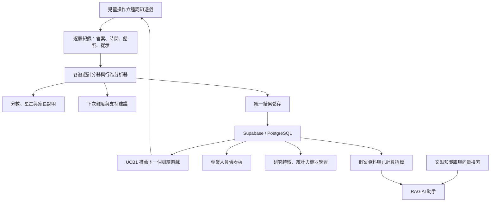

# EF Game 技術架構與實作說明

整理日期：2026-10-01。

本文整理專案使用的技術、資料流、推薦系統、RAG、難度辨別與研究分析方法。內容依據目前原始碼及 `docs/` 文件；程式存在不代表正式環境已部署成功，也不代表已完成研究或臨床效度驗證。本次整理未連線驗證正式環境。

## 1. 系統定位與整體架構

本系統是兒童執行功能遊戲與行為分析平台，核心包含：

1. 六種認知遊戲與逐題行為資料蒐集。
2. 任務專屬計分、錯誤分析及規則式難度調整。
3. UCB1 個人化訓練遊戲推薦與回饋紀錄。
4. RAG 文獻檢索與 AI 個案資料說明。
5. 研究用特徵工程、統計分析、機器學習、可解釋 AI 與長期追蹤。



### 1.1 三種決策機制的分工

| 機制 | 回答的問題 | 目前主要方法 |
| --- | --- | --- |
| 遊戲計分 | 這次表現如何？ | 任務專屬計分公式與行為指標 |
| 難度調整 | 同一遊戲下次要多難、需要什麼支持？ | 規則與門檻判斷 |
| 訓練推薦 | 接下來優先玩哪個遊戲？ | 線上 UCB1 |
| AI 解釋 | 如何說明結果與相關文獻？ | RAG 與語言模型 |
| 研究預測 | 能否從既有資料預測後續表現？ | 研究用機器學習管線 |

分數、星星、下一次難度與推薦遊戲不是同一個輸出。`src/ai/` 中許多功能是規則式分析，不能僅因命名包含 AI 就視為已訓練的機器學習模型。

## 2. 技術堆疊與使用方式

以下版本為 `package.json` 宣告範圍，不等同正式環境實際執行版本。

| 層次 | 技術 | 專案使用方式 |
| --- | --- | --- |
| 前端 | React `^18.2.0`、JavaScript、JSX、CSS | 建立遊戲、訓練地圖、結果頁與不同角色介面 |
| 路由 | React Router DOM `^6.22.0` | 切換遊戲、家長結果與專業研究頁面 |
| 圖表 | Recharts `^3.8.1` | 呈現表現指標、趨勢及研究分析 |
| 後端 | Node.js、Express `^5.2.1` | 提供 AI 助手 API、驗證與模型調用 |
| 雲端資料 | Supabase JS `^2.108.2`、PostgreSQL | 保存個案、結果、逐題資料、推薦決策與研究紀錄 |
| 登入與權限 | Supabase Auth、RLS、SQL RPC | 使用者驗證、依資料關係授權、封裝資料庫操作 |
| 語意向量 | Transformers.js `^4.2.0` | 將文獻與問題轉換為向量 |
| 向量搜尋 | pgvector、HNSW、餘弦相似度 | 搜尋語意相關的文獻段落 |
| 生成式 AI | OpenAI SDK `^6.45.0`、Responses API | 結合個案資料、計算結果與文獻產生說明 |
| PDF 擷取 | pdf-parse `^2.4.5` | 擷取知識庫來源文字 |
| 報表與文件 | ExcelJS `^4.4.0`、docx `^8.5.0` | 支援 Excel 與 Word 文件產出相關能力 |
| 後端設定 | dotenv、cors | 載入環境設定與管理跨來源存取 |
| 測試 | Jest、React Testing Library、Node test | 驗證計算、介面及 API 安全行為 |
| 建置 | react-scripts `5.0.1` | 開發伺服器、前端測試與正式建置 |
| 部署 | GitHub Actions、GitHub Pages 流程 | 建置及發布靜態前端；Express API 需另有執行環境 |
| 效能量測依賴 | web-vitals | 提供網頁效能指標量測能力；是否持續上報需依部署設定確認 |

來源：[package.json](package.json)、[API 伺服器](src/api/server.mjs)、[部署流程](.github/workflows/deploy-pages.yml)。

## 3. 六種遊戲與行為資料

| 遊戲 | 任務內容 | 主要觀察指標 |
| --- | --- | --- |
| SRT | 點擊目標、避開不應點擊的刺激 | 反應時間、漏答、誤點、持續注意與反應抑制 |
| PM | 記住圖片並選回目標 | 記憶負荷、正確率、誤選、取消選取與逾時 |
| CBT | 記住方塊亮起順序並重現 | 序列長度、位置與順序錯誤、重看及提示需求 |
| SSG | 依聲音規則選擇動物 | 刺激反應衝突、搶答、左右偏好與干擾抑制 |
| DCCS | 依顏色、種類及切換規則分類 | 規則切換、沿用舊規則的錯誤與干擾下表現 |
| LB | 依數字與顏色規則完成連線 | 順序處理、規則維持、切換錯誤與完成時間 |

這些指標描述任務行為。例如 DCCS 切換後錯誤增加，可描述為本次切換較困難，不能直接轉成疾病或發展診斷。

### 3.1 資料層級

| 層級 | 紀錄內容 | 用途 |
| --- | --- | --- |
| 參與者 | 匿名研究 ID | 連結同一人的多次資料 |
| 測驗／訓練場次 | 模式、開始時間、完成狀態 | 區分正式測驗與練習 |
| 單一遊戲場次 | 遊戲、難度、任務設定 | 判斷不同結果是否可比較 |
| Trial：單題 | 刺激、正確答案、實際答案、時間、錯誤、提示 | 重建作答過程 |
| 衍生結果 | 分數、統計、特徵與建議 | 呈現結果、推薦與研究分析 |

### 3.2 特徵工程

特徵工程是將逐題紀錄轉換成可比較、可供模型使用的數值。

| 特徵 | 定義 | 如何利用 |
| --- | --- | --- |
| 正確率 | 答對題數／已知正誤題數 | 判斷完成品質 |
| 平均 RT | 有效反應時間的平均 | 描述作答速度 |
| RT 中位數 | 排序後中間位置的反應時間 | 降低少數極端慢反應對摘要的影響 |
| RT 標準差 | 反應時間的離散程度 | 描述速度波動 |
| RT CV | 標準差／平均反應時間 | 相對波動指標 |
| 連續錯誤 | 錯誤連續段數與最長錯誤串 | 觀察錯誤是否集中 |
| 提示／重看比例 | 使用支持的題數／相關題數 | 區分獨立完成與依靠支持 |
| 前後段差異 | 後段與前段正確率、RT 差異 | 描述場次內變化 |
| 反效率 | 平均 RT／正確率 | 同時描述速度與正確性，仍需保留原始指標 |
| 任務專屬特徵 | 記憶廣度、切換後正確率等 | 保留不同遊戲的行為特性 |

研究管線僅以有效 trial 計算分析特徵，保留排除數量與原因；缺少 RT 時保留 `null`，不以零代表缺值。特徵公式變更須更新版本。

例如兩位兒童同為 80% 正確率，其中一位全程獨立完成，另一位大量使用提示，系統可藉由支持使用率產生不同建議。

來源：[特徵字典](docs/feature_dictionary.md)、[逐題處理](src/analytics/trials/)、[特徵管線](src/analytics/features/)。

## 4. 難度辨別與規則式自適應

### 4.1 判斷流程

```text
逐題資料
  → 清理與指標計算
  → 檢查資料是否足夠
  → 比較正確率、錯誤、提示需求與穩定度
  → 輸出升級、維持、降級或支持調整
  → 由遊戲／訓練流程使用建議
```

難度可涉及記憶項目數、序列長度、呈現時間、作答時間、干擾比例、規則切換、提示與題量。分析器提出的調整方向，是否全部直接映射至遊戲參數，需逐項核對遊戲頁面的使用路徑。

### 4.2 SRT：正確性、獨立性與穩定度

SRT 先檢查總題數與有效 RT 數量，資料不足時維持難度。

資料足夠後，升級需同時滿足以下條件：

| 指標 | 條件 |
| --- | --- |
| 正確率 | ≥ 85% |
| 未提示正確率 | ≥ 80% |
| 漏答率 | ≤ 10% |
| 背景誤點率 | ≤ 10% |
| 輔助比例 | ≤ 20% |
| RT CV | 有數值時 ≤ 0.35 |
| 後段下降／疲勞指標 | 不為 high |
| 不應點擊刺激的誤點率 | 該類資料足夠且有數值時 ≤ 15% |

降級條件包括正確率 < 65%、漏答率 > 25%、背景誤點率 > 25%、輔助比例 > 40%、RT CV > 0.5，或高後段下降指標；不應點擊刺激的資料足夠時，誤點率 > 30% 也構成降級條件。其他情況維持。

例如正確率 90% 但大量依靠提示，仍可能不符合升級條件。這些門檻是程式規則，不是已建立的常模界線。

來源：[srtTrainingAnalyzer.js](src/ai/srtTrainingAnalyzer.js)。

### 4.3 CBT：依錯誤型態決定調整方向

CBT 使用依序判斷的規則，前面的條件可優先於分數升級規則。

| 條件範例 | 輸出方向 |
| --- | --- |
| `fatigueDrop ≥ 0.3` | 維持階級、降低負荷 |
| 正確率 < 0.55 且前段錯誤率 ≥ 0.4 | 縮短序列，降低一個微階 |
| 位置錯誤率 ≥ 0.45 | 降低空間負荷，降低一個微階 |
| 順序錯誤率 ≥ 0.45 | 維持階級、降低路徑複雜度 |
| 逾時率 ≥ 0.3 且正確率 ≥ 0.5 | 維持階級、延長作答時間 |
| 救援後答對比例 ≥ 0.4 | 維持並保留重看支持 |
| 閒置提示率 ≥ 0.35 | 增加非文字支持 |
| 分數達升級門檻 | 提高微階 |
| 分數偏低且未命中前述條件 | 降低微階 |

CBT 存在升降兩個微階的分支。線上推薦的 ±1 邊界屬於另一層動作限制，不能概括為所有遊戲分析器都只調一階。

來源：[cbtTrainingAnalyzer.js](src/ai/cbtTrainingAnalyzer.js)、[cbtScoring.js](src/utils/cbtScoring.js)。

### 4.4 其他任務

| 任務 | 分析方式 |
| --- | --- |
| PM | 綜合記憶負荷、正確率、反應時間等資訊，輸出增加、維持或降低，並限制在合法難度範圍 |
| SSG | 分析反應、提示、搶答、偏好與正確性；設計包含多輪確認，預設升級需連續兩輪達標 |
| DCCS | 依不同階段的主要規則、切換後表現及干擾情境分析 |
| LB | 由專屬訓練分析器處理規則、表現與難度建議 |

另有簡化的 `aiDifficultyEngine.js`，依正確率、錯誤總數、RT 與後段下降標記輸出 easy／normal／hard；其存在不代表六種遊戲全部只使用此函式。

來源：[src/ai/](src/ai/)、[各遊戲計分器](src/utils/)。

## 5. 推薦系統：UCB1 多臂吃角子機

### 5.1 演算法概念

線上推薦使用 UCB1（Upper Confidence Bound）。每個遊戲是一個 arm，也就是可選項目：CBT、PM、SRT、SSG、LB、DCCS。

```text
UCB 分數 = 該遊戲平均獎勵
         + sqrt(2 × ln(總選擇次數)／該遊戲選擇次數)
```

- 平均獎勵代表利用已知資訊。
- 探索項讓資料較少的遊戲仍有機會被選到。
- 尚未嘗試的遊戲會先被探索。

### 5.2 實際整合流程

1. 取得目前兒童與允許的訓練遊戲。
2. 驗證帳號與個案關係，取得匿名研究參與者 ID。
3. 讀取已完成的推薦決策，以歷史回饋重建 UCB1 狀態。
4. 建立候選動作，套用遊戲與難度邊界。
5. 選擇動作，先保存決策再呈現。
6. 以推薦結果替換訓練地圖第一關。
7. 完成遊戲後由共用結果儲存路徑建立 outcome。
8. 計算獎勵、追加回饋並更新政策。

`sessionStorage` 保存未完成推薦，避免重新整理一直建立決策；雲端已完成紀錄則用來重建學習狀態。若推薦資料表或連線不可用，保留原訓練計畫並顯示回退訊息。

### 5.3 動作與難度邊界

候選動作包含 `task_code`、`difficulty_level`、`arm_id` 與 `action_id`。預設推薦難度目錄是 1～5。

已知目前難度時，線上邊界允許同級或相差一級；文件的未知難度設計是從低級開始。實際未知值需注意 JavaScript 數值轉換，例如 `Number(null)` 是 0，不能僅依註解認定所有缺值輸入都一定有相同候選集合。線上建立推薦目前預設從 level 1 傳入。

遊戲頁面可能有更細的微階；推薦 level 與任務內部微階不是天然相同的尺度。

### 5.4 獎勵函數

目前提供三種版本：

| 版本 | 目標 |
| --- | --- |
| `reward_accuracy_v1` | 正確率 |
| `reward_efficiency_v1` | 正確率與速度效率 |
| `reward_balanced_v1` | 正確率、效率、穩定度及完成度 |

平衡型預設公式：

```text
reward = 0.55 × accuracy
       + 0.20 × efficiency
       + 0.15 × stability
       + 0.10 × completion
```

各成分及總獎勵限制在 0～1。若 RT 有效，效率的程式公式為：

```text
efficiency = accuracy × clamp(targetRT / max(RT, targetRT × 0.25))
stability  = 1 - clamp(RT變異 / max(targetRT, 1))
```

例如成分為 0.8、0.7、0.9、1，總獎勵為 `0.815`。

一般設計有無效 RT 時給半份正確率作為效率的分支，但目前存在缺值轉換限制：`Number(null)` 會成為 0，線上 outcome 也可能把缺少平均 RT 轉為 0，缺少 RT 變異也可能被當作 0。這可能高估效率或穩定度，因此不能宣稱所有缺值情況都已被保守處理。

### 5.5 已有的其他推薦策略

| 策略 | 原理 | 目前定位 |
| --- | --- | --- |
| Random | 隨機選擇允許動作 | 實驗基準 |
| Rule-based | 依表現與歷史規則排序 | 共同規則基準 |
| ε-Greedy | 多數選平均獎勵最高者，少量隨機探索 | 研究比較 |
| UCB1 | 平均獎勵加探索上界 | 線上整合與研究 |
| Thompson Sampling | 從 Beta 分布抽樣選擇，再以獎勵更新 | 研究比較 |
| Contextual Bandit | 利用行為 context 評估動作 | 對角近似 LinUCB 原型 |

規則比較政策的優先分數為：

```text
priority = (1 - recent_accuracy)
         + 0.25 × bounded_rt_variability
         - 0.15 × recent_performance_change
         - 0.01 × recent_training_count
```

模擬模組在相同的決定性合成環境比較策略。模擬能檢查選擇與更新機制，不能當作真實兒童訓練成效。

### 5.6 目前限制

- UCB1 的統計 arm 是遊戲，尚未將「遊戲 × 難度」分別學習。
- 選到遊戲後，目前取該遊戲在允許清單中的第一個動作；預設清單難度由低到高，難度未另外依獎勵最佳化。
- 線上 context 的 RT 變異與近期表現變化部分仍填 0；outcome 的 `performance_change` 也填 0。
- 線上目標 RT 目前固定為 1,000 ms，尚非各遊戲與難度專屬標準。
- 即時獎勵較高不必然代表長期學習較好。
- 不同遊戲的速度與正確率意義不同，跨任務獎勵仍需校準。
- `exploration` 標記目前主要依是否為未嘗試 arm 設定，不完整代表後續所有受 UCB 探索項影響的選擇。

來源：[推薦文件](docs/adaptive_recommendation.md)、[線上整合](src/analytics/recommendation/onlineRecommendation.js)、[UCB1](src/analytics/recommendation/policies/UCBPolicy.js)、[動作邊界](src/analytics/recommendation/actions.js)、[獎勵函數](src/analytics/recommendation/rewards.js)。

## 6. RAG：文獻檢索增強生成

RAG（Retrieval-Augmented Generation）先檢索相關資料，再讓語言模型根據檢索內容回答。它在本專案的角色是提供文獻與結果說明，不負責直接訓練或取代難度演算法。

### 6.1 知識建庫

```text
來源文件與 metadata
  → PDF／文字擷取
  → 文字清理與分段
  → E5 向量模型
  → 文獻、段落與向量存入 Supabase
```

| 項目 | 程式設定 |
| --- | --- |
| 段落目標大小 | 1,800 字元 |
| 段落重疊 | 250 字元 |
| 最短段落 | 200 字元 |
| 文件最低文字量 | 500 字元 |
| 預設向量模型 | `Xenova/multilingual-e5-small` |
| 向量維度 | 384 |
| 文件前綴 | `passage:` |
| 查詢前綴 | `query:` |
| Pooling | Mean pooling |
| 正規化 | `normalize: true` |

重疊能保留段落邊界的前後文。這裡的大小是字元，不能直接等同模型 token 數或完整可處理的上下文長度。

模型以單例 Promise 載入並使用快取，減少每次 API 呼叫重複初始化；初始化失敗會清除 Promise，容許後續重試。

### 6.2 向量檢索

當使用者提出問題時：

1. 根據問題與上下文建立查詢。
2. 使用相同模型產生查詢向量。
3. 呼叫 `match_clinical_knowledge` RPC。
4. 依遊戲及能力篩選，計算餘弦相似度。
5. 過濾、去重、依相似度排序。
6. 將選出的文獻段落交給模型。

資料庫使用 pgvector 的 `vector(384)`；HNSW 索引用於向量檢索，SQL 以 `1 - cosine_distance` 表示相似度。

| 項目 | API 實際設定 |
| --- | --- |
| 相似度門檻 | 0.45 |
| 初始候選筆數 | 最多 12 |
| 最終段落數 | 最多 6 |
| 單段內容上限 | 4,000 字元 |
| 總文獻內容上限 | 18,000 字元 |

SQL 函式存在不同預設值，但本 API 會明確傳入上述門檻。這條路徑使用向量相似度排序，未見另接專用 cross-encoder 重排序模型。

### 6.3 生成回答

| 輸入 | 用途 |
| --- | --- |
| `patientContext` | 去識別化個案、測驗、訓練及單題資料 |
| `verifiedCalculations` | 程式已完成的數值計算與比較 |
| `professionalKnowledge` | 檢索文獻與來源編號 |

後端使用 Responses API，預設模型為 `gpt-5-mini`，可由 `OPENAI_MODEL` 覆蓋。原始碼預設值不能證明正式環境使用的模型。程式設定 reasoning effort 為 low，最大輸出為 1,800 tokens。

指令要求使用繁體中文、依既有數值回答、引用存在的來源編號、資料不足時明說，並注意不同遊戲、模式與難度的比較限制。沒有檢索文獻時，不得虛構「根據文獻」或引用。

使用者輸入、個案資料與文獻被視為待分析資料，不應成為覆蓋系統規則的指令。這是提示注入防護的一部分，不代表可保證模型完全不出錯。

### 6.4 使用範例與限制

問題：「DCCS 這次切換後為什麼錯比較多？」

- 個案資料提供本次切換前後正確率與錯誤紀錄。
- RAG 找出規則切換、干擾與舊規則持續反應的相關文獻。
- AI 區分客觀紀錄、可能解釋、文獻背景與資料不足之處。

RAG 增加資料依據與可追溯性，但不能保證正確，也不能將一般文獻直接套成個案診斷。知識庫的實際內容、審核品質與覆蓋率仍需另外確認。

來源：[知識庫匯入](scripts/import-knowledge-base.mjs)、[AI 助手](src/api/clinical-assistant.mjs)、[向量資料表與 RPC](supabase/rebuild/05_CREATE_CLINICAL_RAG.sql)。

## 7. 機器學習：行為表現預測

### 7.1 可預測的目標

| 任務 | 資料構造 |
| --- | --- |
| 同次後段表現 | 前 20%、30% 或 50% 有效 trial 作為特徵，後段形成結果 |
| 下一次測驗 | 第 n 次正式測驗預測同遊戲第 n+1 次；訓練不混入此序列 |
| 跨遊戲表現 | 用其他遊戲特徵預測指定遊戲，移除目標遊戲與 overall 欄位 |
| 行為類別 | 採事先聲明的行為門檻，不當成臨床或常模類別 |

### 7.2 模型

| 模型 | 用途 |
| --- | --- |
| Logistic Regression | 行為類別預測 |
| 加權 Logistic Regression | 處理類別不均 |
| Decision Tree | 分類與連續數值預測 |
| Linear Regression | 預測正確率、RT 等連續結果 |
| Random Forest | 多棵樹整合比較，設定至少 30 位參與者才啟用 |

XGBoost、SVM、KNN、MLP 在 v1 明確列為未啟用。現有模型屬研究管線，沒有證據顯示已取代線上規則難度引擎。

### 7.3 防止資料洩漏

同一位兒童的 trial 若同時出現在訓練與測試，模型可能記住個體特性。因此採參與者層級切分：

```text
保留 20% 參與者作為未接觸測試集
  → 其餘參與者進行 GroupKFold／StratifiedGroupKFold
  → 每個訓練折內擬合中位數補值、標準化、零變異特徵篩選
  → 訓練與驗證
  → 以開發集驗證選定設定
  → 在開發集重訓，最後評估保留測試集
```

分類評估包含 Accuracy、Balanced Accuracy、Precision、Recall、F1、ROC-AUC、PR-AUC 與混淆矩陣。迴歸評估包含 MAE、RMSE、R²。

實驗保存資料與特徵版本、模型、超參數、seed、切分清單、評估指標與時間。合成資料明確標為 DEMO，不能混入真實觀察實驗持久化。

來源：[機器學習文件](docs/machine_learning_pipeline.md)、[ML 模組](src/analytics/ml/)。

## 8. 可解釋 AI（XAI）

XAI 用來解釋模型的預測依據，不表示已找到因果原因。

| 方法 | 用法 |
| --- | --- |
| 標準化係數 | 查看線性／邏輯迴歸特徵的方向與相對影響 |
| Permutation Importance | 打亂單一特徵，量測 RMSE 或 balanced accuracy 的變化 |
| 個別加性貢獻 | 線性模型以標準化特徵值乘係數，解釋單筆預測 |
| 特徵替換擾動 | 樹模型將特徵換成訓練參考值，觀察預測差異 |
| 重要性穩定性 | 在參與者分組驗證中比較特徵排名變化 |

線性加性貢獻只有在聲明的訓練平均基準假設下稱為 SHAP；樹模型擾動不標為 TreeSHAP。Logistic Regression 的加性貢獻在 log-odds 尺度，不直接等同機率變化。

專業頁面呈現預測、模型表現、全域／個別解釋、樣本量與版本。資料不足時使用明確標示的合成示範，不能把示範數值當作研究成果。

來源：[XAI 文件](docs/explainable_ai.md)、[解釋模組](src/analytics/explainability/)。

## 9. 統計分析與長期追蹤

### 9.1 統計工具

| 技術 | 用途 |
| --- | --- |
| 平均、中位數、SD、IQR | 描述表現分布 |
| 直方圖、盒鬚圖、Tukey fences | 顯示偏態與離群值，不自動刪除離群值 |
| Pearson／Spearman | 分析特徵相關性 |
| Welch t-test、配對 t-test | 有相應分布與研究條件時進行兩組比較 |
| Mann–Whitney、Wilcoxon | 不假設常態的兩組比較 |
| ANOVA、Kruskal–Wallis | 多組比較 |
| Bootstrap CI | 估計不確定性，保留 seed 與迭代設定 |
| 效果量 | 呈現差異大小 |
| Benjamini–Hochberg FDR | 多重比較校正 |

工具受樣本數、配對、授權分組與研究條件限制。跨遊戲相關要求同一匿名參與者與同一共享場次，不任意把不同日期配成一組。相關與差異不能直接解釋為因果或訓練有效。

### 9.2 長期資料

長期模組建立測驗、訓練、任務結果與推薦決策時間軸，計算：

- 首次有效值與最新值。
- 絕對差異與相對差異；基準為零時相對差異為 `null`。
- 至少三次有效觀察後的 OLS 趨勢斜率。
- 預設三次場次視窗的滾動平均、中位數、標準差。
- 訓練次數與有足夠時間跨度時的頻率。

目前與個人自身基準比較，沒有已驗證的正常兒童常模。不同難度、練習效應及情境可能影響變化。

混合效應模型只有準備度與規劃介面：

```text
outcome ~ session_time + session_type + difficulty + (1 | participant_id)
```

`model_fitted` 仍為 `false`。即使達到至少 20 位參與者且各有三次可比觀察的準備門檻，也不會自動產生模型係數或 p 值。

來源：[統計文件](docs/statistical_analysis.md)、[長期追蹤文件](docs/longitudinal_modeling.md)。

## 10. 權限、安全與資料保存

| 機制 | 使用方式 |
| --- | --- |
| Supabase Auth | 驗證登入身分 |
| RLS | 依帳號與個案關係限制資料讀寫 |
| SQL RPC | 封裝需權限與一致性檢查的操作 |
| API 驗證 middleware | 保護 AI 助手端點 |
| CORS 允許來源 | 限制網站來源 |
| Rate limiting | 預設每分鐘 20 次，可透過環境設定調整 |
| 請求大小限制 | Express 預設 256 KB，可設定 |
| 環境變數 | 管理後端金鑰、模型與連線設定 |
| 匿名研究 ID | 降低研究資料直接識別性 |
| 決策紀錄 | 保存推薦當時的 context、候選、選擇與回饋 |

後端 service-role 權限不應理解成自動受一般使用者 RLS 保護，API 層的驗證與授權仍然必要。本文列出程式中的機制，不代表已完成全面安全稽核。

來源：[API 安全](src/api/api-security.mjs)、[API 伺服器](src/api/server.mjs)、[Supabase SQL](supabase/)。

## 11. 遊戲化、測試與可重現性

### 11.1 遊戲化

星星、貼紙、家具、獎勵排程與訓練地圖提供兒童任務回饋及參與動機。獎勵機制與研究用 reward 函數分屬不同用途：前者是產品互動回饋，後者是推薦演算法的數值目標。

相關檔案：[economyManager.js](src/utils/economyManager.js)、[stickerManager.js](src/utils/stickerManager.js)、[hatRewardScheduler.js](src/utils/hatRewardScheduler.js)。

### 11.2 測試與部署

`package.json` 提供前端測試、API 安全測試、資產引用檢查、正式建置與部署檢查指令。GitHub Pages 負責靜態前端，不會執行 Express 後端。

本次僅整理文件，未重新執行整套測試或部署，因此不宣稱目前所有檢查均通過。

### 11.3 研究可重現性

- 特徵、處理流程、模型、推薦政策與獎勵保留版本。
- 隨機流程使用固定 seed 以利重現。
- 實驗保留參與者切分與評估資訊。
- 推薦保留候選動作與實際 outcome。
- 合成模擬與真實觀察分開標示。
- 缺值、排除原因與樣本不足不應被隱藏。

來源：[可重現性文件](docs/reproducibility.md)、[可重現性模組](src/analytics/reproducibility/)。

## 12. 功能成熟度與報告用定位

| 功能 | 目前可確認的狀態 |
| --- | --- |
| 六種遊戲與任務計分 | 已有實作 |
| 各遊戲規則分析與難度建議 | 已有實作，需區分建議輸出與實際參數套用 |
| 線上 UCB1 | 已接訓練入口與結果回饋，依賴資料庫與登入設定 |
| 其他推薦策略 | 已有研究比較／模擬實作 |
| RAG | 已有建庫、檢索與生成路徑，正式可用性依賴知識庫與服務設定 |
| ML 與 XAI | 已有研究管線；模型品質依賴真實資料與驗證 |
| 統計與長期追蹤 | 已有描述與分析工具，受樣本與可比性限制 |
| 混合效應模型 | 尚未擬合，保留準備度與規劃介面 |
| 臨床診斷、常模、療效證明 | 目前不能由此專案直接宣稱 |

可用於專題報告的描述：

> 本系統以 React 與 Supabase 建立兒童執行功能遊戲平台，蒐集逐題行為資料，透過任務專屬規則進行難度與支持調整，並使用 UCB1 多臂吃角子機實現具回饋紀錄的遊戲推薦。專業端結合多語言向量模型、pgvector 與大型語言模型建立 RAG 文獻輔助說明；研究端則提供特徵工程、統計分析、行為預測與模型解釋功能。各研究模組的結果仍需透過真實資料與研究設計驗證。
