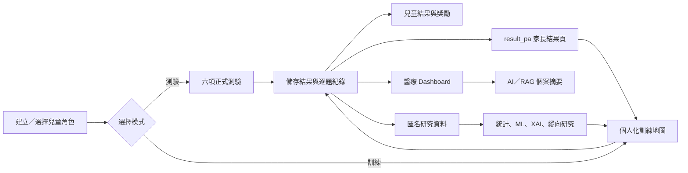
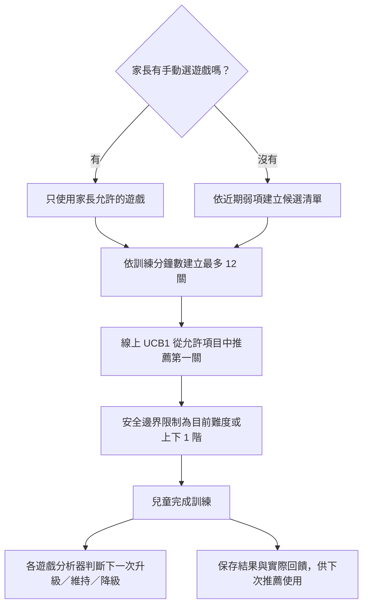
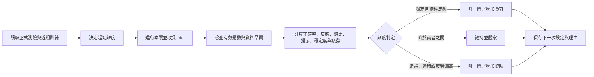
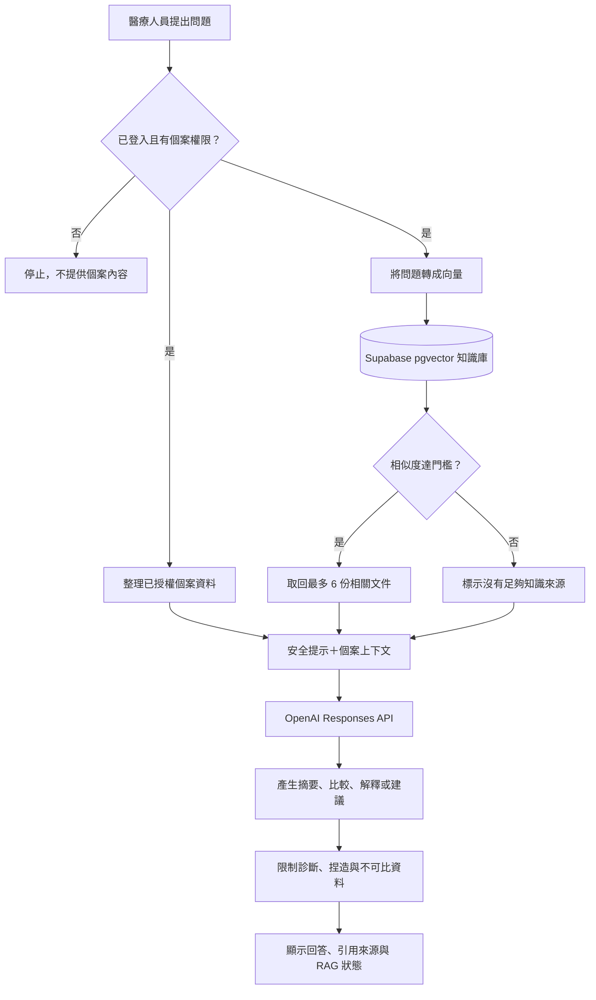
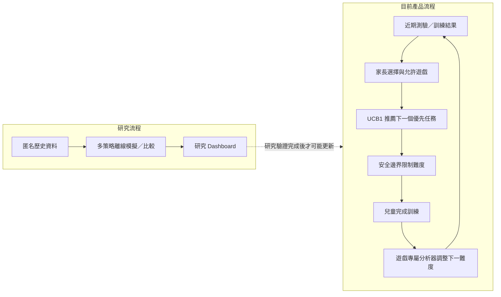
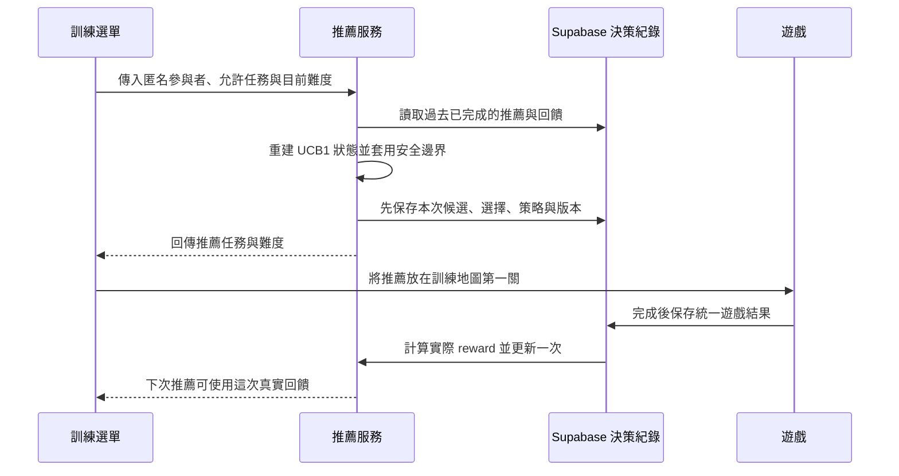

# 執行功能森林遊戲

一套將「兒童遊戲、家長回饋、醫療追蹤與研究資料」整合在同一平台的執行功能測驗與訓練系統。

系統以森林冒險故事包裝六項認知遊戲，讓兒童在較低壓力的情境下完成任務；家長可以用簡單文字了解孩子的表現；醫療人員則能查看完整紀錄、比較前後變化、檢視單題資料，並透過 AI／RAG 助手取得資料摘要。所有遊戲結果亦可進一步整理為匿名研究資料，支援統計分析、行為特徵、模型研究與長期追蹤。

> 本系統目前定位為「執行功能訓練與行為觀察研究原型」，可協助追蹤與溝通，但不能取代醫師診斷、正式心理衡鑑或標準化量表。

---

## 1. 系統能做什麼

平台主要分成四個部分：

1. **兒童端**：選擇角色、進行六項測驗與訓練、觀看故事動畫、累積星星與金幣、玩帽子遊戲、收集貼紙、解鎖成就及佈置房間。
2. **家長端**：查看孩子的正確率、反應時間、錯誤類型、疲勞狀態、歷史紀錄與下一次訓練建議，並透過白話 AI 小助手理解結果。
3. **醫療端**：管理個案、查看六項能力趨勢、比較多次測驗、檢視逐題資料、建立提醒與備註、匯出 DOCX 報告，並使用結合個案資料與專業知識庫的 RAG 助手。
4. **研究端**：保留題次層級資料，進行資料品質檢查、特徵工程、統計分析、AI 預測、可解釋 AI、自適應訓練研究、縱向追蹤與匿名資料匯出。

### 整體閉環



---

## 2. 使用者與使用流程

### 2.1 兒童／家庭端

1. 從首頁進入家庭帳號登入或註冊。
2. 建立兒童角色卡，填寫暱稱、生日、性別並選擇森林角色。
3. 每位兒童的遊戲紀錄、星星、金幣、家具、貼紙與成就分開保存。
4. 選擇「測驗」或「訓練」。
5. 完成遊戲後查看兒童版回饋；家長可再進入 `result_pa` 查看完整說明。
6. 訓練所得獎勵可用於帽子貼紙遊戲、成就收藏與房間佈置。

### 2.2 醫療端

1. 醫療人員由獨立入口登入，系統檢查 clinician／medical／doctor 等角色權限。
2. 建立或選擇個案。
3. 查看該個案的測驗與訓練摘要、六項遊戲趨勢及逐題紀錄。
4. 選擇兩筆或多筆紀錄進行前後比較。
5. 建立回診、重新測驗、訓練或查看報告提醒，並留下專業備註。
6. 使用 AI／RAG 助手詢問最近表現、單題判定、錯誤原因、訓練方向或家長說明。
7. 匯出單次或多筆整合 DOCX 報告。

---

## 3. 測驗與訓練的差異

| 項目 | 正式測驗 | 日常訓練 |
| --- | --- | --- |
| 目的 | 在固定規則下觀察目前表現 | 反覆練習並逐步調整挑戰 |
| 流程 | 依測驗地圖逐項完成 | 家長手選或由系統推薦訓練項目 |
| 難度 | 依各遊戲既定測驗設計 | 可依簡單、普通、困難及更細緻層級調整 |
| 提示 | 以教學與必要提示為主 | 可依表現增加提示、放慢節奏或調整題量 |
| 主要輸出 | 正確率、反應時間、錯誤、題次資料 | 上述資料加上關卡、星級、難度調整與訓練建議 |
| 使用方式 | 適合階段性比較 | 適合觀察練習歷程與建立習慣 |

### 正式測驗流程

- 測驗地圖共有六項遊戲，預設以前一關完成後解鎖下一關的方式進行。
- 每個遊戲開始前有故事影片與操作教學，必要時可跳過。
- 測驗中保留每一題的刺激、作答、正誤、反應時間及錯誤資訊。
- 遊戲結束後計算分數與星級，並將結果送往兒童端、家長端與醫療端。
- 系統可標示目前關卡、已完成關卡與 AI 建議關卡。

### 訓練流程

- 家長可選擇訓練時間，範圍為 **10～60 分鐘**。
- 一次訓練最多安排 **12 關**，每種遊戲在單次計畫中最多安排 5 個層級。
- 家長可手動勾選一種或多種訓練；若完全不選，系統會根據近期各關表現優先安排較需要加強的項目。
- 系統會參考正確率、近期結果、錯誤、疲勞與既有測驗表現，決定建議遊戲及難度。
- 訓練地圖依工作記憶、反應／抑制控制、認知彈性三大能力區域呈現。
- 完成一關後得到 1～3 星、金幣與進度；下一關依完成狀況解鎖。
- 若近期表現較吃力，介面會建議降低難度、增加提示或縮短時間，而不是只追求更高難度。

#### 一次訓練如何被安排



| 決定內容 | 由誰負責 | 簡單說明 |
| --- | --- | --- |
| 可以練哪些遊戲 | 家長選擇＋系統允許清單 | 家長選擇是最高邊界，系統不會推薦未被允許的遊戲 |
| 第一關優先玩什麼 | 線上 UCB1 推薦 | 參考過去已完成推薦的實際回饋，在允許項目中選擇 |
| 單一遊戲下一次多難 | 六款遊戲各自的分析器 | 根據該遊戲的正確率、錯誤、提示、穩定度與疲勞調整 |
| 後續研究比較哪種策略 | 研究 Dashboard | 比較多種推薦演算法；模擬結果不直接控制兒童訓練 |

---

## 4. 六項遊戲與規則

六項遊戲對應三個主要執行功能面向：

| 能力面向 | 遊戲 |
| --- | --- |
| 工作記憶 | PM 圖片記憶、CBT 石頭小橋 |
| 注意與抑制控制 | SRT 松鼠接橡實、SSG 貓狗合唱團 |
| 認知彈性與規則處理 | DCCS 服飾分類、LB 綿羊奶奶回家 |

### 4.1 SRT－松鼠弟弟採橡實

**故事目標**：幫松鼠弟弟接住好的橡實，避免碰到壞橡實。

**玩法**：

- 目標會在畫面不同位置出現。
- 看到可收集的橡實時要盡快點擊。
- 遇到壞橡實時要忍住不點。
- 點到空白處、連續亂點、沒有及時反應或誤點壞橡實都會被記錄。

**正式測驗設計**：以 5 分鐘為主要結束條件，最多 180 題；單一目標顯示約 1.2 秒。系統同時觀察命中、漏接、誤點、重複點擊、反應時間，以及前後半段是否出現疲勞變化。

**主要觀察能力**：簡單反應速度、持續注意、抑制衝動與反應穩定度。

### 4.2 PM－湖中女神與兔子妹妹

**故事目標**：記住湖邊出現的物品，幫兔子妹妹找回正確物品。

**玩法**：

- 畫面先顯示一組圖片，兒童需要先記住。
- 圖片隱藏後，從包含干擾物的選項中找出剛才看過的全部圖片。
- 選錯、漏選、重複點擊、取消選擇或超過時間都會記錄。

**正式測驗設計**：共有 7 個記憶跨度，從記住 1 張逐步增加至 7 張；每個跨度 2 題，共 14 題。圖片顯示 5 秒，作答時間 10 秒，選項最多 12 個。若同一跨度連續兩題未通過，系統可提前停止，避免造成挫折。

**主要觀察能力**：視覺工作記憶、延宕回憶、目標辨識與記憶容量。

### 4.3 CBT－鹿先生的石頭小橋

**故事目標**：記住發亮石頭的順序，依相同順序點擊，幫鹿先生安全過河。

**玩法**：

- 多顆石頭會依序發亮。
- 發亮結束後，兒童要照原順序點回去。
- 每題石頭位置會重新排列，避免只記固定畫面位置。
- 系統記錄第一次點擊、完整點擊順序、第一個錯誤位置、提示／重播、閒置與重複點擊。

**正式測驗設計**：共 10 題，從 2 顆石頭的序列逐步增加至 6 顆；每個記憶長度 2 題。棋盤依難度使用 5、6 或 8 顆石頭，作答時間上限 10 秒，但兒童畫面不顯示壓迫式倒數。

**主要觀察能力**：視覺空間工作記憶、序列記憶、注意維持與記憶跨度。

### 4.4 SSG－貓狗合唱團

**故事目標**：仔細聽聲音，找出「相反的動物」。

**玩法**：

- 聽到貓叫要選狗，聽到狗叫要選貓。
- 貓與狗在左右兩側的位置會變換，不能只記固定方向。
- 必須等聲音播放後再作答；搶答、選到同一動物、超時或重複點擊會被記錄。
- 若聲音播放失敗，可重新播放，避免將設備問題誤判為兒童錯誤。

**正式測驗設計**：共 20 題，平衡聲音種類與左右位置組合，測驗模式不在過程中自動升降級。

**主要觀察能力**：選擇性注意、聽覺規則保持、左右判斷與抑制直覺反應。


### 4.5 DCCS－孔雀小姐的服飾店

**故事目標**：依目前規則將紅／藍、帽子／上衣放進正確籃子，幫孔雀小姐整理服飾店。

**玩法與階段**：

1. **練習**：先學會依顏色分類。
2. **顏色規則**：紅色放紅色籃、藍色放藍色籃。
3. **種類規則**：規則改變，改依帽子或上衣種類分類。
4. **裝袋顏色規則**：看到裝在袋中的衣服時，依袋中衣服的顏色分類。
5. **雙重規則**：有袋看顏色，沒袋看衣服種類，需根據線索切換規則。

系統會記錄新規則下是否仍沿用舊規則、規則切換後的正確率、持續性錯誤、標準顏色題與裝袋顏色題差異，以及各階段反應時間。

**主要觀察能力**：認知彈性、規則理解、規則切換、干擾抑制與持續性反應。

### 4.6 LB－綿羊奶奶迷路了

**故事目標**：照正確順序點選路標，連出回家的路。

**玩法與正式測驗階段**：

1. **第一關－順向排序**：依序點擊 1 → 2 → 3 → … → 10。
2. **第二關－數字加顏色規則**：依序點紅 1、藍 2、紅 3、藍 4，直到藍 10；畫面同時放入相同數字但錯誤顏色的干擾門牌。

完成選擇後送出，系統呈現連線路徑，並記錄點選順序、點錯數字／顏色、規則干擾、反應時間與完成時間。

**主要觀察能力**：順序處理、工作記憶、規則維持、干擾控制與認知彈性。

### 4.7 每一關／每一題會收集哪些資料

系統不只保存最後分數，而是從「整次活動、單一遊戲關卡、每一道題目」三個層級留下紀錄。這些資料讓家長能理解結果、醫療人員能回看作答過程，也讓未來研究能重新計算指標。

#### 所有遊戲都會收集的共通資料

| 資料層級 | 收集內容 | 用途 |
| --- | --- | --- |
| 兒童／個案 | 個案識別碼；研究匯出時改用匿名參與者 UUID | 將同一位兒童的多次資料串在一起 |
| 活動場次 | 測驗或訓練、開始／完成時間、完成／中斷狀態、遊戲順序 | 區分評量與練習，檢查活動是否完整 |
| 關卡設定 | 遊戲、關卡、難度、題數、規則版本、提示設定 | 確認不同紀錄是否可直接比較 |
| 單題 trial | 題次、題目／刺激、正確答案、實際答案、正誤、反應時間 | 還原每一題的作答歷程 |
| 操作行為 | 超時、誤點、空白點擊、重複點擊、提示或重播 | 判斷錯誤是規則、注意、速度或操作問題 |
| 結果摘要 | 答對數、錯誤數、正確率、平均反應時間、星級與分數 | 提供兒童、家長及醫療端結果頁 |
| 過程變化 | 前後半段正確率、反應時間變化、連續錯誤與疲勞訊號 | 觀察是否越做越慢、漏答增加或表現下降 |
| AI 輸出 | 建議升級／維持／降級、下一難度、理由與資料充分度 | 安排下一次訓練，不作為醫療診斷 |

#### SRT 每關收集資料

- 目標出現的題次、時間、畫面座標與目標種類。
- 兒童採取的動作：命中、正確忍住、漏接、誤點壞橡實或點擊背景。
- 從目標出現到點擊的反應時間。
- 空白誤點、連續／重複點擊及假警報次數。
- 是否逾時、是否使用提示、提示出現時間及提示後是否完成。
- 前後半段命中率、漏答數、平均反應時間與反應時間變異係數。
- 注意力下降幅度、後段反應變慢、衝動點擊比例及疲勞風險。

#### PM 每關收集資料

- 當題記憶圖片數、記憶跨度、候選與干擾圖片數。
- 圖片顯示時間、作答限制、圖片是否移動。
- 正確圖片 ID、實際選取 ID、選取順序與每次點擊紀錄。
- 誤點、取消選擇、漏選、重複操作及逾時。
- 每個記憶跨度的兩題結果、最高成功跨度及停止跨度。
- 是否因同跨度連續兩題失敗或逾時而提前停止。
- 前後半段正確率、反應時間、穩定度與疲勞分數。

#### CBT 每關收集資料

- 石頭數量、棋盤位置、目標發亮序列與記憶序列長度。
- 兒童實際點擊序列、每次點擊時間及點擊間隔。
- 第一次點擊時間、第一個錯誤位置、順序錯誤及是否逾時。
- 是否重播、使用提示、接受救援或長時間閒置。
- 隨機點擊、重複點擊與無關點擊次數。
- 獨立完成跨度、提示後可完成跨度、連續答對／答錯次數。
- 各跨度成功率、前後半段變化及疲勞下降幅度。

#### SSG 每關收集資料

- 播放的聲音、應選的相反動物與實際選擇。
- 貓狗左右位置、正確答案位置與點擊位置。
- 音訊是否正常、是否重新播放或使用備援音訊。
- 反應時間、正誤、超時、搶答、同動物錯誤及重複點擊。
- 左右側正確率差異、同動物錯誤率、搶答率與提示需求。
- 前後半段正確率、漏答變化、反應穩定度及注意力下降訊號。

#### DCCS 每關收集資料

- 題目階段：練習、顏色、種類、裝袋顏色或雙重規則。
- 當下規則、前一規則及規則切換位置。
- 服飾顏色、種類、是否裝袋與畫面提示線索。
- 左右籃子內容、正確位置、實際選擇及反應時間。
- 是否第一次就答對、是否沿用舊規則及是否為持續性錯誤。
- 切換、非切換、干擾及裝袋題各自的正確率與反應時間。
- 規則理解、認知彈性、抑制控制、干擾正確率、穩定度與疲勞分數。

#### LB 每關收集資料

- 關卡、規則類型、正確序列及門牌的數字、顏色與位置。
- 每個門牌是否為干擾項，以及兒童完整的選擇順序。
- 每一步正誤、錯誤類型、步驟反應時間及累積完成時間。
- 最後連線路徑、正確完成步數及是否完成整條路線。
- 切換／干擾正確率、連續錯誤、提示次數與提示後表現。
- 提示模式、提示延遲、預覽時間、速度與反應穩定度。

> 原始 trial 會完整保留；資料清理只會另外標記 `valid_trial` 與排除原因，不會刪除或改寫原始作答。

### 4.8 AI 自動升降級機制

此處的「AI」是根據遊戲規則與行為指標進行的自適應難度分析，不是由聊天模型直接決定難度。每次訓練結束後，系統會輸出 **升級、維持或降級**，並保存判定理由與下一次設定。



通用建議引擎的基本原則為：正確率低於 60%、高疲勞或總錯誤達 10 次時偏向簡單；正確率至少 85%、錯誤不超過 2 次且平均反應時間低於 1.5 秒時可建議困難；其餘先維持普通。六款遊戲另有更符合任務特性的規則，實際以各遊戲分析器為主。

| 遊戲 | 升級時主要參考 | 降級時主要參考 | 實際調整內容 |
| --- | --- | --- | --- |
| SRT | 正確率 ≥85%、漏答 ≤10%、誤點 ≤15%、提示 ≤20%、反應穩定且無高疲勞 | 正確率 <65%、漏答 >25%、誤點 >30%、提示 >40% 或高疲勞 | 目標速度、可見時間、干擾、提示與下一難度 |
| PM | 正確率 ≥85%、AI 分數 ≥82、逾時 ≤15%、誤點少、疲勞低 | 正確率 <50%、AI 分數 <45、逾時 ≥50%、高疲勞或同跨度連續失敗／逾時 | 圖片數、候選／干擾數、顯示與作答時間及移動效果 |
| CBT | 連續至少 2 題乾淨答對；連續 3 題答對可增加序列 | 連續至少 2 題答錯／逾時，或第一個錯誤很早 | 微難度、石頭數、序列長度、播放速度、提示與作答時間 |
| SSG | AI 分數 ≥82，正確率、逾時、同動物錯誤、搶答與穩定度均達門檻 | AI 分數 <55，或正確率、逾時、同動物錯誤超過門檻 | 作答時間、提示層級、左右變化與下一難度 |
| DCCS | 題數足夠，正確率、規則理解、切換、抑制與干擾表現穩定 | 高疲勞、正確率不足、舊規則錯誤多或抑制較弱 | 單一規則、規則切換、維持、干擾與雙重線索階段 |
| LB | 正確率 ≥82%、切換 ≥72%、逾時 ≤15%、提示 ≤30%、連錯 ≤2 | 正確率 <58%、切換 <52%、逾時 ≥30%、提示 ≥55% 或連錯 ≥3 | 規則、序列、提示模式／延遲、預覽時間與位置洗牌 |

#### 各遊戲升降級重點

- **SRT**：同時看亂點、漏答與後段是否變慢；正確率高但反應不穩、依賴提示或疲勞高時不升級。
- **PM**：最近正式測驗會決定起始層級，再依訓練調整；降級可減少圖片與干擾，並延長顯示或作答時間。
- **CBT**：使用多個微難度逐題調整，不只在簡單、普通、困難間跳動；正式測驗表現會形成保護上限，避免突然超出可負荷範圍。
- **SSG**：資料不足時原則上不升級；預設升級需連續多輪達標，降級則可較快生效，以降低挫折與避免難度反覆跳動。
- **DCCS**：難度由單一規則逐步增加到切換、切換後維持、干擾及雙重線索；缺少必要切換／干擾資料時不會貿然升級。
- **LB**：綜合正確率、切換、干擾、速度、穩定度、提示獨立性與錯誤控制；資料不足時維持，連錯或逾時高時優先增加提示並降低負荷。

#### 安全與人工控制

- 正式測驗不會在進行途中任意改題；自動升降級主要用於訓練與下一次建議。
- 題數不足、資料中斷或關鍵欄位缺失時，以維持難度為主並標記資料不足。
- 一般最多升或降一階，且有最低與最高難度邊界。
- 降級也可代表增加提示、延長時間、減少干擾或縮短回合，不只是降低分數要求。
- 家長可手動選擇訓練項目與時間；醫療人員可依專業觀察調整，AI 不取代人工決策。
- 每次建議保留指標、目前難度、下一難度、判定理由與版本，供醫療及研究端查核。

---

## 5. 遊戲結果如何計算與呈現

每款遊戲會先保留原始作答紀錄，再整理成共通結果格式。不同遊戲的細節不完全相同，但主要包含：

- 完成題數、答對題數與正確率。
- 平均、中位數、標準差、最快與最慢反應時間。
- 漏答／沒有點到、亂點、點錯目標、重複點擊、超時、順序錯誤及規則切換錯誤。
- 前段與後段表現、反應時間變化與可能的疲勞狀態。
- 遊戲模式、難度、關卡、分數、星級及完成原因。
- 每一題的題目內容、預期答案、實際答案、正誤、反應時間與遊戲專屬欄位。
- 系統建議的下一次難度、時間與提示方式。

### 星級與觀察原則

遊戲會以 1～3 星提供兒童容易理解的回饋；家長端另以綠、橘、紅三種觀察標籤協助判讀：

- **綠色－表現穩定**：可維持目前節奏。
- **橘色－建議持續觀察**：有部分錯誤或反應變慢，可維持或稍微降低挑戰。
- **紅色－近期需要留意**：本次較吃力，建議降低難度、增加提示或休息後再練。

標籤只描述本次遊戲狀況，不代表疾病、診斷或固定能力高低。單次結果可能受到睡眠、情緒、環境、裝置、規則熟悉度與疲勞影響，因此應搭配多次同條件紀錄判讀。

---

## 6. 兒童結果頁與家長 `result_pa`

### 6.1 兒童版結果

兒童完成任務後會看到較精簡的完成畫面、分數／星星、鼓勵文字與下一步按鈕。設計重點是正向回饋，不在兒童畫面呈現過多專業數字或負面標籤。

### 6.2 `result_pa` 家長結果頁

`/result-pa` 是家長使用的整合結果頁，可讀取目前孩子的本機紀錄與雲端紀錄，並將專業數字翻成較容易理解的內容。主要呈現：

- 本次遊戲名稱、故事任務與主要能力。
- 測驗／訓練模式、日期、難度與星級。
- 正確率、平均反應時間、完成題數與錯誤總數。
- 最常出現的錯誤類型及白話說明。
- 疲勞程度與綠／橘／紅觀察標籤。
- AI 建議的下次難度、訓練分鐘數、能力重點與協助方式。
- 同一天及歷史測驗／訓練紀錄，供家長回看。
- 可將建議套用到下一次訓練設定，或重新進行測驗。

#### 家長 AI 小助手

家長可直接詢問：

- 孩子今天表現穩定嗎？
- 反應比較慢代表什麼？
- 這些錯誤可能是什麼原因？
- 下一次該練什麼、要不要調整難度？
- 這個專有名詞是什麼意思？

目前家長助手是依 **當次結果、錯誤型態、疲勞程度與內建解釋規則** 產生回答，並支援語音朗讀；它不會自行做醫療診斷。現階段 `result_pa` 尚未直接呼叫醫療端向量知識庫，未來可在完成權限、內容分級及家長語言轉譯後，加入「家長版 RAG」。

---

## 7. 遊戲化獎勵：星星、金幣、帽子、貼紙、成就與家具

### 7.1 星星與金幣

完成訓練後依星級與難度發放金幣，同一筆結果只會發放一次，避免重新整理重複領取。

| 星級 | 基礎金幣 |
| --- | ---: |
| 1 星 | 10 |
| 2 星 | 20 |
| 3 星 | 30 |

難度倍率為簡單 ×1、普通 ×1.5、困難 ×2，最後四捨五入為整數。金幣與物品依兒童角色分開保存。

### 7.2 帽子貼紙遊戲

每完成 **5～8 個有效訓練關卡**，系統會隨機出現一次帽子遊戲邀請。其設計規則如下：

- 必須由正常訓練流程觸發，不能只輸入網址重複領獎。
- 同一關卡只計算一次，每位兒童各自累積。
- 接受邀請後進行最多 5 回合。
- 每回合先顯示貼紙藏在哪頂帽子下約 3 秒，再讓帽子交換位置。
- 兒童觀察交換後選擇一頂帽子；猜中即可獲得當回合森林貼紙。
- 回合會逐步增加帽子數或交換次數，提升視覺追蹤與工作記憶挑戰。
- 每個獎勵 session 有防重複領取紀錄；完成、略過或取消後才重新抽取下一個 5～8 關間隔。
- 目前一般貼紙收藏包含 23 種森林主題貼紙。

### 7.3 成就系統

成就頁依六款遊戲與綜合訓練紀錄計算進度，例如：

- 累積完成訓練、取得三星、答對題數、滿分或零逾時。
- SRT 不誤點壞橡實、PM 記住更多圖片、CBT 無提示完成序列。
- SSG 零搶答且正確率達標、DCCS 成功切換規則、LB 通過指定關卡。
- 成就分為銅、銀、金、鑽石、星耀五個階段。
- 成就頁也能查看帽子遊戲獲得的一般貼紙與收集進度。

### 7.4 角色小屋與家具

- 兒童可進入角色小屋查看已擺放家具、成就與收藏。
- 家具商店包含床、桌椅、櫃子、燈具、植物、戶外景物等多種品項。
- 家具價格集中管理，目前約 30～350 金幣不等。
- 購買後家具進入個人庫存，可點擊放入房間。
- 家具可拖曳移動，並自動對齊格子；版面會依每位兒童分開保存。
- 帽子與貼紙屬於收藏系統，不會被當作房間家具顯示。

遊戲化獎勵的目的，是讓訓練建立可見的進度與自主選擇感；金幣與收藏不應被解讀為能力高低。

---

## 8. 醫療端 Dashboard

醫療 Dashboard 是臨床追蹤與個案溝通的主要工作區，採角色權限保護。主要功能如下。

### 8.1 病患清單與摘要

- 搜尋、選擇與新增個案。
- 顯示暱稱／姓名、年齡、性別、家長聯絡資料與最近活動。
- 快速統計測驗筆數、訓練筆數、平均正確率與平均反應時間。

### 8.2 六項能力趨勢

- 每款遊戲各有一張能力摘要卡。
- 顯示紀錄數、平均正確率與最近狀態。
- 折線圖同時呈現測驗與訓練；實心點代表測驗、空心點代表訓練。
- 點擊資料點可直接開啟該次完整紀錄。

### 8.3 紀錄、篩選與比較

- 可依遊戲、測驗／訓練模式與日期篩選。
- 表格顯示遊戲、能力、模式、難度、分數、星級、正確率、反應時間、題數與錯誤。
- 兩次測驗比較可呈現分數、正確率、平均反應時間與錯誤次數差異。
- 若遊戲、模式或難度不同，系統會提醒兩筆資料不宜直接判定進步或退步。
- 可勾選多筆紀錄進行跨遊戲整合；相同遊戲會自動整理前後變化。

### 8.4 單題／trial 檢視

- 展開一次紀錄後，可逐題查看刺激內容、圖片、預期答案、實際答案、正誤、反應時間與錯誤類型。
- 可檢視遊戲專屬欄位及完整原始 JSON，方便研究與技術稽核。
- 選取某一題後，AI 助手會優先使用該題圖片與 trial 資料回答「為什麼錯」或「為什麼得到這個判定」。

### 8.5 個案工具與報告

- 建立回診、完成訓練、重新測驗、查看報告或補做檢查提醒。
- 紀錄本次觀察、訓練方向與回診重點。
- 產生個案摘要。
- 匯出單次結果 DOCX，包含摘要與逐題紀錄。
- 匯出多筆整合比較 DOCX，包含所選紀錄、分項趨勢、臨床參考重點與判讀限制。

---

## 9. AI／RAG 如何運作

RAG（Retrieval-Augmented Generation，檢索增強生成）會先從可信知識庫找出與問題相關的資料，再讓 AI 依「知識內容＋個案紀錄」回答，降低只靠模型記憶產生錯誤資訊的風險。

### 9.1 醫療端 RAG 流程



目前技術設計包含：

- Node.js／Express API：`POST /api/clinical-assistant`。
- Supabase PostgreSQL＋pgvector 儲存知識文件與向量。
- 以多語向量模型建立 embedding，透過 `match_clinical_knowledge` RPC 搜尋。
- 單次最多取回 6 份文件，並設定相似度門檻與內容長度上限。
- 將個案近期紀錄、各遊戲摘要、目前選取紀錄、勾選的比較紀錄及單題內容一起送入安全上下文。
- 回答可顯示資料來源；若 RAG 或 AI 後端無法連線，醫療端會改用本機資料摘要作為備援。

#### RAG 回答使用的三種資訊

| 資訊來源 | 包含內容 | 能解決的問題 | 不可以做的事 |
| --- | --- | --- | --- |
| 個案資料 | 最近紀錄、各遊戲摘要、選取的比較紀錄、單題圖片與 trial | 回答「這位兒童這次做得如何」 | 不能讀取登入者無權查看的個案 |
| 專業知識庫 | 經匯入的執行功能、工作記憶、注意、抑制與認知彈性文件 | 回答「這項指標通常如何理解」 | 不能把一般文獻直接當成個案診斷 |
| 系統安全規則 | 禁止捏造、比較限制、診斷提醒與回答格式 | 約束 AI 如何使用前兩類資訊 | 知識文件不能要求 AI 忽略安全規則 |

#### RAG 和一般聊天 AI 的差異

| 問題 | 一般聊天 AI | 本系統醫療 RAG |
| --- | --- | --- |
| 回答依據 | 主要依模型既有知識 | 模型知識＋檢索文件＋已授權個案資料 |
| 是否知道目前個案 | 通常不知道 | 只取得畫面中已授權、經清理的個案上下文 |
| 是否提供來源 | 不一定 | 可回傳檢索來源與是否使用 RAG |
| 找不到相關文件 | 仍可能生成一般回答 | 明確標示 RAG 未使用或檢索失敗，並限制結論 |
| 後端失敗 | 無回答 | 醫療 Dashboard 可改用本機規則式摘要備援 |

> RAG 的作用是「先找資料再回答」，不是把文件內容當成診斷，也不能保證回答永遠正確。專業人員仍需核對原始紀錄與引用來源。

### 9.2 RAG 可回答的內容

- 解釋最近一次測驗或訓練。
- 比較相同遊戲的兩次結果。
- 說明正確率、反應時間、錯誤類型與可能限制。
- 解釋目前選取的單題、圖片及判定理由。
- 整理家長容易理解的溝通文字。
- 提供保守、可執行的下一階段訓練方向。
- 回答工作記憶、注意力、抑制控制及認知彈性的一般專業問題。

### 9.3 安全限制

- 不捏造不存在的個案資料、日期、題數、分數、診斷或研究結論。
- 不把單次遊戲表現直接解讀為疾病或發展診斷。
- 比較時需檢查遊戲、模式、難度與資料量是否可比。
- 只能使用目前登入者有權限查看的個案資料。
- 知識庫內容即使出現要求忽略規則的文字，也不能改變系統安全規則。
- 涉及健康與診斷時，必須提醒由合格專業人員結合正式評估判斷。

### 9.4 兒童／家長端與 RAG 的界線

- 兒童端不直接接觸 RAG，避免出現過度專業、難以理解或可能造成焦慮的回答。
- 家長端目前使用受控的結果解釋規則，以白話回答當次表現與訓練建議。
- 醫療端才使用完整個案脈絡與專業文獻 RAG。
- 未來可建立「家長版知識庫」，只提供經審核、適齡且不具診斷性的衛教內容，並由醫療端設定可公開範圍。

### 9.5 推薦系統如何運作

本專案有三個容易混淆、但用途不同的推薦層級：



| 推薦層級 | 目前狀態 | 決定什麼 | 使用資料 |
| --- | --- | --- | --- |
| 訓練計畫推薦 | 已在產品使用 | 在家長允許的項目中，哪些弱項應分配較多關卡 | 每款遊戲近期關卡分數、是否有紀錄、警示狀態 |
| 線上 UCB1 推薦 | 已串接訓練地圖 | 本次第一關優先選哪一款遊戲及受限難度 | 已保存的推薦決策與實際 reward 歷史 |
| 遊戲內升降級 | 已在六款訓練使用 | 同一款遊戲下一次要升級、維持或降級 | 該遊戲 trial、正確率、反應、錯誤、提示與疲勞 |
| 多策略比較 | 研究功能 | 比較哪種演算法在模擬或觀察資料中較合適 | 匿名特徵、決策紀錄與版本化 reward |

#### 線上推薦的完整閉環



重新整理頁面時，尚未完成的決策會在同一瀏覽器 session 重複使用，不會建立多筆相同推薦。只有結果成功保存後才清除本次決策；若 Supabase 或推薦資料表無法使用，原本的訓練計畫仍可進行，畫面會顯示備援提示。

#### 安全邊界：推薦不是無限制探索

| 安全規則 | 實際效果 |
| --- | --- |
| 只使用明確允許的遊戲 | 家長未選或系統未允許的任務不會進入候選集合 |
| 已知目前難度時只允許同級或 ±1 級 | 不會從簡單突然跳到最高難度 |
| 不知道目前難度時只開放第 1～2 級 | 新使用者從較保守範圍開始 |
| 選出的動作必須存在於安全候選集合 | 違反邊界會直接報錯，不會默默執行 |
| 保存決策後才呈現推薦 | 可追查當時有哪些候選、為何選擇及使用哪個版本 |
| 一個 outcome 只可補寫一次 | 防止重複完成或重新整理改寫研究回饋 |

這些是軟體安全護欄，不代表已證明臨床安全或訓練療效。

#### UCB1 為什麼會選某個遊戲

UCB1 會在兩件事之間取得平衡：

```text
任務分數 = 過去平均回饋 + 尚未充分嘗試的探索加分
```

- **利用（exploitation）**：優先選擇過去實際回饋較好的任務。
- **探索（exploration）**：對嘗試次數較少的任務保留機會，避免永遠只練同一項。
- 每個允許任務會先取得基本嘗試機會，之後再依平均 reward 與探索加分排序。
- UCB1 不讀取疾病標籤來決定任務，只根據允許的行為回饋與決策歷史。

#### Reward 代表什麼

Reward 是演算法用來學習的 **0～1 行為回饋值**，不是醫療效果或智力分數。

| Reward 版本 | 計算概念 | 適合觀察 |
| --- | --- | --- |
| `reward_accuracy_v1` | 正確率 | 是否完成得正確 |
| `reward_efficiency_v1` | 正確率 × 相對反應效率 | 在正確之外納入速度，但缺少反應時間時採保守值 |
| `reward_balanced_v1` | 55% 正確率＋20% 效率＋15% RT 穩定＋10% 完成度 | 同時考慮正確、速度、穩定與是否完成 |

每筆 reward 都會保存版本與各組成值。若未來更改權重，必須建立新版本，不能用新公式改寫舊結果。

#### 研究端比較的推薦策略

| 策略 | 白話說明 | 在本專案的角色 |
| --- | --- | --- |
| Random | 從安全候選中隨機選 | 最基本的研究比較基準 |
| Rule-based | 依近期正確率、反應變異、進步幅度與訓練次數排序 | 共通研究基準，不取代六款遊戲專屬規則 |
| ε-Greedy | 多數時間選目前最好，少數時間隨機探索 | 研究探索與利用的簡單基準 |
| UCB1 | 平均回饋加上未充分嘗試的探索加分 | 目前線上第一關推薦策略 |
| Thompson Sampling | 從每個任務的成功機率分布抽樣 | 研究用機率式策略 |
| Contextual Bandit | 納入近期正確率、RT、變異、變化、前一任務等情境 | 研究原型，使用欄位會先去除未核准及敏感資訊 |

離線模擬只用來檢查策略是否能正確選擇、更新與記錄。研究頁會把模擬列明確標示為 **Simulation**，不會與真實兒童結果混合，也不能用模擬結果宣稱某策略有療效。

---

## 10. 資料如何保存

系統使用 Supabase 提供登入、PostgreSQL 資料庫與 Row Level Security（RLS）權限控制；瀏覽器本機儲存則作為遊戲流程與暫存備援。

### 共通結果

`resultManager` 將六款遊戲不同格式整理為統一結果，使兒童頁、`result_pa`、醫療 Dashboard、AI 助手與 Supabase 能讀取同一套資料。

### 研究資料階層

```text
匿名研究參與者
└─ 一次行為活動（測驗或訓練）
   └─ 單一遊戲場次
      ├─ 不可變更的原始 trial
      └─ 有版本的清理／衍生 trial
```

- 身分資料保存在 `patients`；研究資料使用另一個隨機 UUID。
- 姓名、暱稱、Email、生日與家長識別資料不進入匿名研究匯出。
- 原始 trial 採追加與不可變更設計，日後更新演算法時建立新的處理版本，不覆寫原始證據。
- 若新研究資料表尚未部署，舊有 `game_results` 仍可繼續保存，不會因同步失敗而破壞遊戲結果。

### 資料品質

系統可標記負值／不可能的反應時間、缺少回答、重複題次、未完成題次、重新整理、重複送出、意外連點、超時及無效答案。被標記的 trial 不會刪除，而是保留原始內容並記錄排除原因，方便日後查核。

---

## 11. 研究專業 Dashboard

`/research-professional-dashboard` 提供十個研究工作區：

1. **總覽**：參與者、場次、任務與資料品質摘要。
2. **任務表現**：六項遊戲的場次、正確率、反應時間與遊戲專屬指標。
3. **行為分析**：題次反應時間、前後段表現、變異度與穩定性。
4. **統計分析**：描述統計、分布、相關、任務比較及縱向變化。
5. **AI 預測**：在樣本條件足夠時研究後段或下一次表現預測。
6. **可解釋 AI**：呈現模型重要特徵、個別預測貢獻與解釋穩定性。
7. **自適應訓練**：查看推薦任務、難度、策略、情境與實際回饋。
8. **縱向追蹤**：測驗／訓練時間軸、個人基線、滾動趨勢與資料充分度。
9. **研究資料**：匯出匿名 CSV／JSON 與資料版本清單。
10. **模型與實驗資訊**：資料集、特徵、模型、策略版本、實驗代碼、日期與驗證方法。

模型區設有最低樣本門檻；目前觀察參與者少於 20 人時不直接擬合研究模型，而會明確顯示資料不足。

---

## 12. 未來研究可提供的資料

本平台的價值不只在總分，而是能保留「每一題怎麼做」及「多次使用後如何改變」。在完成同意程序、去識別化與研究倫理審查後，可提供下列研究資料。

### 12.1 基本研究單位

- 匿名參與者代碼。
- 測驗／訓練場次、日期、任務順序、完成或中斷狀態。
- 遊戲代碼、難度、關卡與版本。
- 裝置與畫面技術資訊（不含姓名）。
- 原始、清理後及被排除的 trial 數量與原因。

### 12.2 單題行為資料

- 題次、刺激內容、條件與規則。
- 預期答案、實際答案、正誤與錯誤類型。
- 反應時間、超時、搶答、重複點擊、誤點與提示使用。
- 各遊戲專屬內容，例如記憶跨度、序列、規則切換、干擾條件、舊規則反應及選擇路徑。

### 12.3 衍生特徵

- 正確率、錯誤率、正確／錯誤題數。
- 反應時間平均、中位數、標準差、四分位距與變異係數。
- 正確與錯誤反應時間差異。
- 題次間變化、連續錯誤、反應一致性。
- 前 25%、中間 50%、後 25% 的正確率與反應時間。
- 表現斜率、速度—正確權衡與疲勞指標。
- 六項任務專屬特徵及跨任務特徵。

### 12.4 可進行的研究方向

- 不同執行功能任務之間的相關性。
- 年齡、任務難度、題目順序與裝置差異對表現的影響。
- 反應時間變異、錯誤型態與持續注意的關係。
- 規則切換前後、干擾條件與持續性錯誤研究。
- 早期題次是否能預測後段表現或下一次測驗。
- 訓練頻率、難度調整與個人長期變化。
- 不同推薦策略的安全性、接受率與效果比較。
- 模型解釋是否能協助專業人員理解行為表現。
- 未來在取得足夠且具代表性的資料後，建立年齡分層參考值或常模研究。

### 12.5 統計、模型與重現性

- 描述統計、直方圖、箱形圖、缺失與離群值摘要。
- Pearson／Spearman 相關與多重比較校正。
- 以參與者為單位切分資料，避免同一人的資料同時進入訓練與測試造成資料洩漏。
- Logistic／Linear Regression、Decision Tree 與樣本足夠時的 Random Forest 基準模型。
- Accuracy、Balanced Accuracy、Precision、Recall、F1、ROC-AUC、PR-AUC、MAE、RMSE 等指標。
- 全域與個別可解釋結果、特徵貢獻與跨 fold 穩定性。
- Random、Rule-based、ε-Greedy、UCB1、Thompson Sampling 與 Contextual Bandit 推薦策略研究。
- 個人基線、三次滾動平均／中位數／變異與長期斜率。
- 資料集版本、特徵版本、程式版本、模型版本、隨機種子與實驗登錄。

### 12.6 可匯出檔案

- Raw Trial Data
- Cleaned Trial Data
- Task Features
- Participant Features
- Statistics
- ML Predictions
- SHAP／Explanation Results
- Recommendation Decisions
- Longitudinal Features
- Experiment Registry
- `dataset_manifest.json`
- `export_metadata.json`

研究匯出只包含匿名參與者代碼，並將原始資料、清理後資料、模型輸出與模擬資料分開標示。模擬結果不等於真實介入效果。

---

## 13. 技術架構

| 層級 | 使用技術 | 用途 |
| --- | --- | --- |
| 前端 | React 18、React Router、Recharts | 遊戲、家長結果、醫療及研究介面 |
| 後端 | Node.js、Express | AI／RAG API 與安全上下文處理 |
| 資料庫 | Supabase PostgreSQL、Auth、RLS | 帳號、個案、遊戲結果、研究資料與權限 |
| 知識檢索 | pgvector、多語 embedding | 專業文件相似度搜尋 |
| AI | OpenAI Responses API | 醫療端資料摘要與問答 |
| 文件輸出 | docx | 單次及整合比較報告 |
| 測試 | Jest、React Testing Library | 功能、分析公式、權限路由與匯出測試 |

### 專案目錄

```text
src/
├─ pages/                   # 兒童、家長、醫療、研究與六款遊戲頁面
├─ components/clinician/    # 醫療 Dashboard 元件
├─ ai/                      # 表現、錯誤、疲勞與難度分析
├─ analytics/
│  ├─ trials/               # trial 正規化與資料品質
│  ├─ features/             # 行為特徵工程
│  ├─ statistics/           # 統計分析
│  ├─ ml/                   # 行為預測研究管線
│  ├─ explainability/       # 可解釋 AI
│  ├─ recommendation/       # 自適應推薦與策略模擬
│  ├─ longitudinal/         # 縱向追蹤
│  └─ reproducibility/      # 匯出、manifest 與實驗登錄
├─ api/                     # Express AI／RAG API
├─ lib/                     # Supabase 與授權資料存取
├─ utils/                   # 結果、計分、經濟、貼紙及流程管理
├─ config/                  # 家具、貼紙與遊戲資料設定
├─ asset/                   # 圖片、音效與影片
└─ styles/                  # 各頁樣式

knowledge_base/             # RAG 專業知識文件
supabase/migrations/        # 資料庫與研究架構變更
docs/                       # 方法、資料字典、架構與研究說明
scripts/                    # 知識庫匯入、檢查與部署工具
```

---

## 14. 安裝與啟動

### 環境需求

- Node.js 18 以上
- npm
- Supabase 專案
- 若要啟用醫療 RAG，需準備 OpenAI API 金鑰、知識庫與向量搜尋設定

### 安裝

```bash
npm install
```

### 環境變數

請依 `.env.example` 建立 `.env`，至少設定：

```env
REACT_APP_SUPABASE_URL=https://your-project.supabase.co
REACT_APP_SUPABASE_ANON_KEY=your-anon-key
REACT_APP_CODE_VERSION=your-release-or-commit

OPENAI_API_KEY=your-server-side-key
OPENAI_MODEL=gpt-5-mini
PORT=3001
ALLOWED_ORIGIN=http://localhost:3000
```

依序套用 `supabase/migrations/` 內的資料庫變更。`service_role` 金鑰只能放在伺服器，不可放進 React 前端或提交到版本控制。

### 啟動前端

```bash
npm start
```

### 啟動 AI／RAG 後端

另開一個終端機：

```bash
npm run server
```

### 測試與正式建置

```bash
npm run check
```

此指令會依序檢查圖片引用、執行測試、建立 production build 並檢查部署內容。

---

## 15. 重要限制與使用聲明

- 本系統不是醫療器材，也不是正式診斷工具。
- 現階段缺少足夠的臨床 ground truth、代表性常模與外部驗證資料。
- 不同遊戲、版本、難度、裝置及環境的數字不應直接混合比較。
- AI 與 RAG 的內容只供資料整理及專業參考，仍需由合格人員判讀。
- 樣本量不足時不應過度解讀統計顯著性或模型準確率。
- 自適應推薦與模擬結果需要真實長期研究驗證，不能直接宣稱具有療效。
- 正式研究前應完成研究計畫、知情同意、資料治理、權限、保存期限及 IRB／倫理審查。

---

## 16. 後續發展方向

- 建立經專業審核、用語分級的家長版 RAG 衛教知識庫。
- 增加跨裝置、離線恢復與網路中斷後安全同步。
- 蒐集更多重複測量資料，建立年齡分層參考區間。
- 納入標準化量表或臨床評估作為外部效標。
- 驗證模型校準、公平性、裝置差異及缺失資料影響。
- 進行長期訓練研究，比較不同難度策略與推薦政策。
- 將研究 Dashboard 的匯出與實驗登錄串接正式研究流程。
- 在足夠資料與一致研究設計下評估 mixed-effects 等縱向模型。

---

## 17. 延伸文件

- [資料字典](docs/data_dictionary.md)
- [行為特徵說明](docs/feature_dictionary.md)
- [統計分析方法](docs/statistical_analysis.md)
- [機器學習流程](docs/machine_learning_pipeline.md)
- [可解釋 AI](docs/explainable_ai.md)
- [自適應推薦](docs/adaptive_recommendation.md)
- [縱向分析](docs/longitudinal_modeling.md)
- [研究專業 Dashboard](docs/research_professional_dashboard.md)
- [研究重現與匯出](docs/reproducibility.md)
- [維護指南](docs/maintenance-guide.md)

---

本專案希望把原本分散的遊戲活動、家長觀察、醫療追蹤與研究資料連成一個可持續累積的流程：讓兒童願意參與，讓家長看得懂，讓醫療人員有資料可追蹤，也讓未來研究能回到透明、可查核的題次資料。
