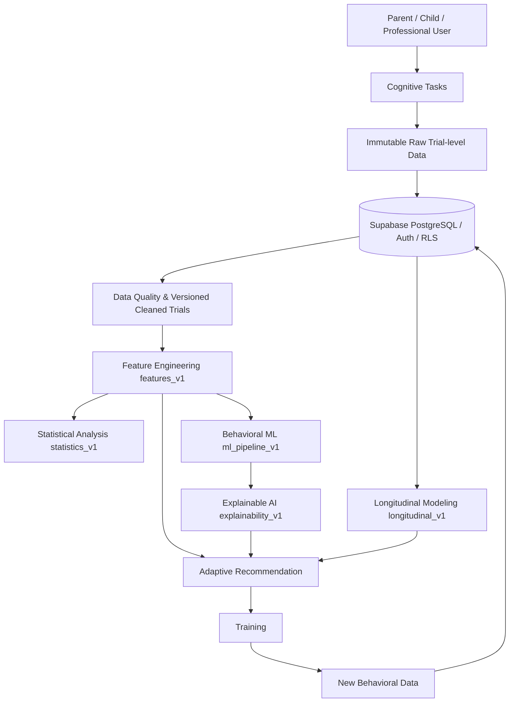

# 遊戲式學齡前幼兒執行功能之評測與適性訓練系統設計

Closed-loop Adaptive Cognitive Assessment & Training System — Research Prototype

> 本系統目前為研究與教育用途，分析結果不能取代標準化心理衡鑑或臨床診斷。

## 1. Project Background

本專案以學齡前幼兒的數位認知任務為情境，建立從 assessment、trial-level behavior recording、feature engineering、statistics、behavioral performance prediction、explanation、adaptive recommendation、training 到 longitudinal tracking 的研究型閉環系統。前端使用 React 18、React Router 與 Recharts；資料與權限使用 Supabase/PostgreSQL/Auth/RLS；Node.js/Express 提供 AI/RAG prototype API。

目前只分析認知任務中的行為表現，不建立疾病診斷、正常／異常分類或病患風險判定。

## 2. Research Motivation

傳統總分難以保留反應時間、錯誤型態、trial-to-trial variation、前後段變化與提示使用等過程資訊。本系統將每次互動保存為可版本化 trial data，讓研究者能追蹤「原始行為如何轉換成特徵、統計結果、模型預測、解釋與訓練推薦」。

## 3. Research Gap

本專案聚焦下列技術與研究缺口：

- 遊戲任務資料格式不一致，難以進行跨任務研究分析。
- 只有 summary score 時，無法重現 trial-level feature derivation。
- 一般 random split 可能讓同一 participant 同時進入 train/test，造成 data leakage。
- 模型 prediction 若缺少 explanation、sample disclosure 與 validation lineage，容易被過度解讀。
- Adaptive recommendation 若缺少 policy/reward/decision log，無法比較或重現。
- Simulation、prototype 與真實幼兒實證結果必須清楚區隔。

## 4. Research Questions

- **RQ1**：哪些 Trial-level 行為特徵與認知任務表現最相關？
- **RQ2**：不同 Machine Learning 方法的預測能力是否有所差異？
- **RQ3**：Accuracy、RT、RT variability 與時間序列表現中，哪些特徵對預測最重要？
- **RQ4**：六項認知任務是否具有不同的行為模式？
- **RQ5**：早期 Trial 行為資料是否可以預測後續任務表現？
- **RQ6**：Explainable AI 是否能提供具可理解性的行為特徵解釋？
- **RQ7**：不同 Adaptive Recommendation Policy 在模擬／未來實證資料中是否呈現不同訓練效率？

目前 Repository 能提供這些問題的分析架構與軟體 prototype；沒有足夠真實樣本時，不宣稱已得到具外部效度的研究結論。

## 5. System Architecture



完整資料鏈：`Raw Behavior → Feature → Trend → Model → Explanation → Recommendation`。

## 6. Cognitive Tasks

Repository 實作六項任務，不自行新增未存在的認知任務：

| Code | Task | 主要行為面向 |
| --- | --- | --- |
| CBT | Corsi Block Tapping | 空間序列記憶、span、順序錯誤 |
| PM | Picture Memory | 圖片記憶、不同實際難度表現 |
| SRT | Simple Reaction Task | 反應時間、遺漏／錯誤反應、RT variability |
| SSG | Sound-Symbol Game | 實際 stimulus/probe condition 下的反應表現 |
| LB | Linking Balloons | 完成、順序／路徑相關行為 |
| DCCS | Dimensional Change Card Sort | 規則切換、switch/non-switch、perseverative behavior |

## 7. Trial-level Data Architecture

Phase 1 建立：

```text
Anonymous Participant
  → Behavioral Session
    → Task Session
      → Immutable Raw Trial
        → Versioned Cleaned/Derived Trial
```

Raw acquisition payload 不因後續演算法更新而改寫。Cleaned trial 保存 `valid_trial`、`exclusion_reasons`、processing version 與 task-specific metadata；異常資料保留而非直接刪除。Schema、RLS、ER diagram 與欄位定義見 [docs/data_dictionary.md](docs/data_dictionary.md)。

主要 migration：

- `20260730_phase1_behavioral_data_architecture.sql`
- `20260730_phase4_ml_experiment_tracking.sql`
- `20260730_phase6_recommendation_decisions.sql`
- `20260730_phase9_experiment_registry.sql`

## 8. Feature Engineering

`src/analytics/features/` 提供 deterministic `features_v1`：

- Accuracy、Error Rate、Correct/Incorrect counts
- Mean/Median/SD/Min/Max/IQR/CV RT
- Correct/Incorrect RT
- Trial-to-trial change、error streak、response consistency
- Early 25%／Middle 50%／Late 25%
- Accuracy/RT change 與 slope
- Speed–Accuracy indicators
- 六項任務實際可推導的 task-specific features
- Task-level 與 participant cross-task datasets

公式見 [docs/feature_dictionary.md](docs/feature_dictionary.md)。Late-session indicators 是行為變化指標，不是疲勞診斷。

## 9. Statistical Analysis

`statistics_v1` 提供 descriptive statistics、histogram、box plot、missing/outlier summary、Pearson/Spearman method selection、feature/task correlations、FDR、group-comparison utilities 與 descriptive longitudinal changes。統計文字限於 association、difference、pattern；不從 observational data 宣稱因果。

方法見 [docs/statistical_analysis.md](docs/statistical_analysis.md)，專業頁面：`/research-statistics`。

## 10. Machine Learning Pipeline

目前沒有外部標準量表或合法臨床 ground truth，因此 target 限於：

- Early 20%／30%／50% trials 預測 later accuracy/RT
- Previous assessment 預測 next assessment task performance
- Other-task features 預測指定 task performance

Baseline：Logistic Regression、Decision Tree、Linear Regression、Decision Tree Regressor。Random Forest 只在 participant 數達門檻時啟用；XGBoost、SVM、KNN、MLP 在 v1 明確列為未啟用，不因模型複雜度而硬加。

Classification metrics：Accuracy、Balanced Accuracy、Precision、Recall、F1、ROC-AUC、PR-AUC、Confusion Matrix。Regression metrics：MAE、RMSE、R²。詳見 [docs/machine_learning_pipeline.md](docs/machine_learning_pipeline.md)。

## 11. Data Leakage Prevention

```text
Participants
  → fixed 20% untouched participant-level test
  → development participants
    → GroupKFold / StratifiedGroupKFold validation
      → fit imputation/scaling/feature filtering on training fold only
```

同一 participant 不會同時出現在 development 與 untouched test。Fold 內的 median imputation、scaling、feature filtering、class weighting 與 bootstrap 只以該 training fold 擬合。禁止 random trial-level train/test split。

## 12. Explainable AI

`explainability_v1` 只解釋 validation-selected behavioral model：

- Linear/Logistic：standardized coefficient 與 training-mean additive SHAP；classification 顯示 log-odds scale。
- Tree/Forest：held-out permutation importance 與 local reference perturbation，不冒稱 SHAP。
- 個別頁面顯示 prediction、適用時的 probability/confidence、positive/negative contributors 與 feature values。
- 跨 participant folds 檢查 importance rank stability，差異大時揭露 caution。

詳見 [docs/explainable_ai.md](docs/explainable_ai.md)，專業頁面：`/ai-behavioral-analysis`。

## 13. Adaptive Training

既有 CBT/SRT/DCCS/SSG 等 task-specific rule recommendation 與 GameMenu plan 均保留。研究比較框架另外提供：

- Random baseline
- Documented common Rule-based baseline
- ε-Greedy
- UCB1
- Thompson Sampling
- Behavioral-only Contextual Bandit

Bandit arm v1 為 training task。Difficulty 經 allowed-action boundary 過濾，只能維持或移動一級；未知目前難度時限於 Level 1–2。Accuracy、Efficiency、Balanced reward 各有 `reward_version`。Decision log 保存 context、available actions、selected action、predicted/actual reward 與 policy version。

Offline environment 結果固定標示 Simulation，不代表幼兒真實介入效果。詳見 [docs/adaptive_recommendation.md](docs/adaptive_recommendation.md)。

## 14. Longitudinal Tracking

`longitudinal_v1` 建立 Assessment、Training、Task、Result、Recommendation timeline，並計算 personal baseline、latest、absolute/relative change、session-index slope、training frequency 與三-session rolling mean/median/variability。少於三次觀察時 withholding trend，不用不充分資料畫可靠趨勢。

Mixed Effects 只有 readiness architecture，`model_fitted=false`。詳見 [docs/longitudinal_modeling.md](docs/longitudinal_modeling.md)，專業頁面：`/longitudinal-dashboard`。

## 15. Experiment Tracking

Phase 4/9 Experiment Registry 記錄：

- Experiment ID、research question
- Dataset/feature/pipeline version
- Target、model、hyperparameters、seed
- Participant holdout 與 grouped cross-validation
- Metrics、training timestamp、code/model version
- Result path

正式 registry 可輸出 `experiment_registry.csv` 與 `experiment_registry.json`。Synthetic experiments 不能寫入 observed experiment table。

## 16. Dashboard

`/research-professional-dashboard` 是十章研究工作區：Overview、Task Performance、Behavioral Analysis、Statistical Analysis、AI Prediction、Explainable AI、Adaptive Training、Longitudinal Tracking、Research Data、Model/Experiment Info。

它不是一般商業健康 Dashboard，不顯示正常／異常紅綠燈、疾病風險百分比或診斷結論。詳見 [docs/research_professional_dashboard.md](docs/research_professional_dashboard.md)。

## 17. Research Export & Reproducibility

統一 export bundle 以 CSV 為主、JSON 為 metadata：

- Raw Trial Data
- Cleaned Trial Data
- Task Features
- Participant Features
- Statistics
- ML Predictions
- SHAP Results
- Recommendation Decisions
- Longitudinal Features
- Experiment Registry
- `dataset_manifest.json`
- `export_metadata.json`

Manifest 保存 dataset version、generated time、participant/session/task/trial/exclusion counts、feature/code version。直接識別資訊不加入研究 export。匯出規格見 [docs/reproducibility.md](docs/reproducibility.md)。

## 18. Research Limitations

- Currently limited sample size.
- Lack of normative population data.
- Lack of clinical ground truth.
- ML models require external validation.
- Adaptive training requires longitudinal empirical validation.
- Simulation results do not equal real intervention outcomes.
- Task conditions、difficulty、device、motivation、practice 與 missingness 可能影響觀察結果。
- 本系統不能取代標準化認知衡鑑。
- 本系統不能提供臨床診斷。

## 19. Ethics / Disclaimer

研究 dataset 使用匿名 `research_participants.id`；姓名、Email 與 guardian identifiers 留在 identity/authorization layer。Supabase RLS 控制 participant-related data access。所有 ML/XAI 輸出定位為 Behavioral Performance Analysis、Research Prototype、Cognitive Task Performance Pattern 或 Training Recommendation。

> 模型目前僅供研究用途，其結果尚未完成臨床效度驗證。

## 20. Future Work

- 依核准研究 protocol 蒐集足夠且具代表性的 repeated participant data。
- 導入合法外部標準量表／ground truth 後重新定義 target。
- 外部 validation、calibration、fairness 與 device robustness analysis。
- Nested participant-grouped hyperparameter tuning。
- 預先註冊 adaptive policy、reward 與安全界線，進行 longitudinal empirical evaluation。
- 在資料條件與研究設計足夠時實作 mixed-effects model。
- 建立正式 normative dataset 前，不提供 normative comparison。

## 21. Reproduction Guide

### Requirements

- Node.js 18+
- npm
- Supabase project

### Install and configure

```bash
npm install
```

建立 `.env`：

```env
REACT_APP_SUPABASE_URL=https://your-project.supabase.co
REACT_APP_SUPABASE_ANON_KEY=your-anon-key
REACT_APP_CODE_VERSION=git-commit-or-release-tag
OPENAI_API_KEY=optional-server-side-key
OPENAI_MODEL=gpt-5-mini
PORT=3001
ALLOWED_ORIGIN=http://localhost:3000
```

依檔名順序套用 `supabase/migrations/`。Production/secret 環境不可把 `service_role` key 放入 React client。

### Run

```bash
npm start
npm run server
```

### Test and build

```bash
npm test -- --watchAll=false
npm run build
```

### Reproduce a research export

1. 以授權 professional account 登入。
2. 開啟 `/research-professional-dashboard`。
3. 選擇 anonymous participant。
4. 在 Research Data 下載 CSV/JSON bundle。
5. 先檢查 `dataset_manifest.json` 的 dataset/feature/code version 與 counts。
6. 使用 `experiment_registry.json` 對應 research question、target、split、metrics 與 result path。
7. 不將 Simulation 或 Synthetic rows 合併為 observed research results。

## 22. Repository Structure

```text
src/
  analytics/
    trials/             # raw-to-cleaned trial mapping and quality
    features/           # features_v1
    statistics/         # statistics_v1
    ml/                 # participant-safe ML pipeline
    explainability/     # global/local explanation and stability
    recommendation/     # baselines, bandits, rewards, decisions
    longitudinal/       # timelines, rolling/trend features
    researchDashboard/  # dashboard CSV helpers
    reproducibility/    # unified export, manifest, registry
  ai/                   # existing task analyzers and AI utilities
  api/                  # Express AI/RAG endpoints
  lib/                  # Supabase client and authorized data access
  pages/                # child/parent/professional/research pages
  styles/
docs/                   # methods, dictionaries, limitations, portfolio summary
supabase/migrations/    # additive research schema migrations
```

## 23. AI / RAG Prototype

Node/Express API 可使用 OpenAI Responses API；RAG prototype 使用 pgvector 與 Hugging Face embedding workflow。這些摘要與 retrieval 結果是輔助資訊，不能取代專業衡鑑。相關 scripts 與 knowledge-base 設定以 Repository 實際檔案為準。

## 24. Testing

測試使用 Jest 與 React Testing Library，涵蓋 trial hierarchy/validation、feature formulas、statistics、participant split/preprocessing、ML metrics、XAI contribution/stability、recommendation policies/rewards/safety、longitudinal rolling/readiness、CSV/export/manifest/registry。最終實際通過數量請以當次 `npm test -- --watchAll=false` 輸出為準。
