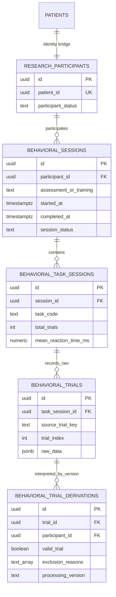

# Phase 1 Behavioral Data Dictionary

Version: 1.0.0  
Scope: Corsi Block Tapping (CBT), Picture Memory (PM), Simple Reaction Task (SRT), Sound-Symbol Game (SSG), Linking Balloons (LB), DCCS.

Phase 2 derived features and formulas are versioned separately in [`feature_dictionary.md`](./feature_dictionary.md). Raw and normalized Phase 1 fields remain unchanged by feature calculation.

Phase 3 statistical methods, distribution rules, longitudinal gates and exports are documented in [`statistical_analysis.md`](./statistical_analysis.md).

> 本系統目前為研究與教育用途，分析結果不能取代標準化心理衡鑑或臨床診斷。

## Identity and research export rule

`patients` remains the operational identity table. `research_participants.id` is a separate random UUID and is the only participant identifier allowed in analytical datasets. Names, nickname, email, birth date, guardian ID, and `patient_id` are not model or research-export features. The `research_participants.patient_id` bridge is access-controlled and must not be included in de-identified exports.

## ER diagram

## Participant layer — `research_participants`

| Field | Type | Description | Unit | Source | Nullable | Example | Research Meaning |
|---|---|---|---|---|---|---|---|
| `id` | uuid | Anonymous research participant identifier | — | Database generated | No | `8068…` | Grouping key for participant-level analysis and split |
| `patient_id` | uuid | Restricted identity bridge to operational patient | — | `patients.id` | No | `149a…` | Not exportable; authorization/linkage only |
| `participant_status` | text | active/withdrawn/archived | — | Study administration | No | `active` | Controls research eligibility; not a model feature |
| `created_at` | timestamptz | Bridge creation time | UTC timestamp | Database | No | `2026-07-30T…Z` | Data lineage |
| `updated_at` | timestamptz | Bridge update time | UTC timestamp | Database | No | `2026-07-30T…Z` | Data lineage |

## Session layer — `behavioral_sessions`

| Field | Type | Description | Unit | Source | Nullable | Example | Research Meaning |
|---|---|---|---|---|---|---|---|
| `id` | uuid | Behavioral session identifier | — | Client UUID | No | `510e…` | Groups task sessions completed in one session |
| `participant_id` | uuid | Anonymous participant FK | — | Identity bridge | No | `8068…` | Participant grouping key |
| `session_type` | text | Session protocol type | — | Application | No | `single_task_session` | Distinguishes protocol structures |
| `assessment_or_training` | text | `assessment` or `training` | — | Existing result mode | No | `assessment` | Separates measurement from intervention exposure |
| `started_at` | timestamptz | Session start | UTC timestamp | Existing task/session | Yes | `2026-07-30T01:00:00Z` | Duration/order analysis |
| `completed_at` | timestamptz | Session completion | UTC timestamp | Existing task/session | Yes | `2026-07-30T01:04:00Z` | Completion and duration |
| `device_information` | jsonb | Browser/device context without user name | — | Browser | No | `{"screenWidth":1280}` | Technical variance and quality review |
| `task_order` | text[] | Ordered task codes | ordinal | Application | No | `{SRT,SSG}` | Order/fatigue effect analysis |
| `session_status` | text | in_progress/completed/interrupted/abandoned | — | Application | No | `completed` | Session completeness |
| `source_result_id` | text | Link to legacy `game_results.id` | — | Result manager | Yes | `SRT-test-…` | Idempotency/backward traceability |
| `schema_version` | text | Behavioral contract version | — | Application | No | `1.0.0` | Reproducibility |

## Task layer — `behavioral_task_sessions`

| Field | Type | Description | Unit | Source | Nullable | Example | Research Meaning |
|---|---|---|---|---|---|---|---|
| `id` | uuid | Task-session identifier | — | Client UUID | No | `b061…` | Parent key for trials |
| `session_id` | uuid | Behavioral session FK | — | Session | No | `510e…` | Session membership |
| `task_code` | text | CBT/PM/SRT/SSG/LB/DCCS | — | Game route/result | No | `DCCS` | Task stratum |
| `task_name` | text | Human-readable task name | — | Mapping registry | No | `Dimensional Change Card Sort` | Reporting label |
| `task_order_index` | integer | Position within session | ordinal | Application | No | `2` | Task-order effects |
| `difficulty` | text | Difficulty used | task-defined | Existing task | Yes | `normal` | Protocol/load covariate |
| `started_at` | timestamptz | Task start | UTC timestamp | Existing result | Yes | `…` | Task duration |
| `completed_at` | timestamptz | Task end | UTC timestamp | Existing result | Yes | `…` | Task duration |
| `total_trials` | integer | Number of raw trials | count | Canonical trial list | No | `20` | Completeness denominator |
| `correct_trials` | integer | Correct raw trials | count | Normalizer | No | `16` | Descriptive summary, not source of truth |
| `incorrect_trials` | integer | Incorrect raw trials | count | Normalizer | No | `4` | Descriptive summary |
| `mean_reaction_time_ms` | numeric | Mean RT among currently valid numeric RT trials | ms | Normalizer | Yes | `723.5` | Convenience summary; recomputable |
| `completion_status` | text | Task completion state | — | Application | No | `completed` | Completeness filter |
| `raw_task_data` | jsonb | Protocol/session snapshot without identity or duplicated trial arrays | — | Existing result | No | `{…}` | Protocol lineage |
| `raw_schema_version` | text | Source mapping version | — | Application | No | `1.0.0` | Reproducibility |

## Raw trial layer — `behavioral_trials`

Raw rows are append-only. A trigger rejects changes to `raw_data`, `raw_schema_version`, `task_session_id`, and `source_trial_key`.

| Field | Type | Description | Unit | Source | Nullable | Example | Research Meaning |
|---|---|---|---|---|---|---|---|
| `id` | uuid | Raw trial ID | — | Client UUID | No | `02cb…` | Stable derivation parent |
| `task_session_id` | uuid | Task-session FK | — | Task session | No | `b061…` | Trial grouping |
| `source_trial_key` | text | Original trial identifier/index | — | Existing trial | No | `7` | Duplicate/retry audit |
| `trial_index` | integer | Best available ordinal | ordinal | Existing trial | Yes | `7` | Within-task sequence |
| `occurred_at` | timestamptz | Best available event time | UTC timestamp | Existing trial | Yes | `…` | Temporal ordering |
| `received_at` | timestamptz | Database ingestion time | UTC timestamp | Database | No | `…` | Ingestion lineage |
| `raw_data` | jsonb | Exact original task trial object | task-defined | Task page | No | `{ "rt": 620, … }` | Immutable behavioral evidence |
| `raw_schema_version` | text | Acquisition/mapping schema | — | Application | No | `1.0.0` | Reproducibility |
| `raw_data_sha256` | text | Optional canonical raw-data hash | hex digest | Future server ingestion | Yes | `a84…` | Integrity/deduplication support |

## Processed common trial layer — `behavioral_trial_derivations`

| Field | Type | Description | Unit | Source | Nullable | Example | Research Meaning |
|---|---|---|---|---|---|---|---|
| `id` | uuid | Derivation row ID | — | Database | No | `ef09…` | Versioned processed record |
| `trial_id` | uuid | Immutable raw trial FK | — | Raw trial | No | `02cb…` | Raw/processed lineage |
| `participant_id` | uuid | Anonymous participant FK | — | Session relationship | No | `8068…` | Participant-level grouping/splitting |
| `task_name` | text | Canonical task name | — | Task registry | No | `Picture Memory` | Reporting |
| `task_code` | text | Canonical task code | — | Task registry | No | `PM` | Task stratum |
| `trial_index` | integer | Canonical ordinal | ordinal | Mapper | Yes | `3` | Sequence effects |
| `stimulus` | jsonb | Canonical stimulus representation | task-defined | Mapper | Yes | `[2,5,1]` | Experimental input |
| `condition` | text | Experimental condition/rule | — | Mapper | Yes | `bagColor` | Condition effects |
| `difficulty` | text | Trial difficulty/load | task-defined | Mapper | Yes | `normal2` | Load covariate |
| `expected_response` | jsonb | Correct/required response | task-defined | Mapper | Yes | `"left"` | Accuracy reconstruction |
| `actual_response` | jsonb | Participant response | task-defined | Mapper | Yes | `"right"` | Behavioral response |
| `is_correct` | boolean | Response correctness | — | Existing trial | Yes | `false` | Accuracy outcome |
| `reaction_time_ms` | numeric | Response latency | ms | Existing RT aliases | Yes | `812` | Speed outcome |
| `error_type` | text | Recorded/mapped error | — | Existing trial/validator | Yes | `timeout` | Error-pattern analysis |
| `task_specific_metadata` | jsonb | Non-common task fields | task-defined | Mapper | No | `{ "memoryCount": 4 }` | Preserves experimental detail |
| `valid_trial` | boolean | Current quality decision | — | Validator | No | `false` | Analysis inclusion flag; never deletes raw row |
| `exclusion_reasons` | text[] | One or more quality reasons | — | Validator | No | `{timeout}` | Transparent exclusion audit |
| `processing_version` | text | Mapper/validator algorithm version | — | Application | No | `trial-normalizer-1.0.0` | Reproducibility |
| `is_current` | boolean | Current derivation version | — | Processing pipeline | No | `true` | Select latest interpretation |
| `processed_at` | timestamptz | Processing timestamp | UTC timestamp | Database | No | `…` | Lineage |

## Data validation rules

Quality rules are acquisition checks, not normative cut-offs. A flagged trial is retained.

| Code | Trigger | Result |
|---|---|---|
| `negative_reaction_time` | RT < 0 ms | invalid |
| `impossible_reaction_time` | RT below task acquisition minimum or above maximum | invalid |
| `missing_response` | response required, no response, and not timeout | invalid |
| `duplicated_trial` | repeated source trial key within a task session | invalid |
| `interrupted_session` | session marked interrupted | invalid for current derivation |
| `unfinished_trial` | trial explicitly incomplete | invalid |
| `browser_refresh` | acquisition context reports refresh recovery | invalid |
| `repeated_submit` | idempotency/retry context reports duplicate submission | invalid |
| `accidental_double_click` | repeated click/deselect count > 0 | invalid |
| `timeout` | task records timeout | invalid; raw retained |
| `invalid_response` | response outside task response set | invalid |

RT acquisition bounds: SRT/SSG 80–30,000 ms; DCCS 80–60,000 ms; CBT/PM/LB 80–120,000 ms. These bounds are versioned technical plausibility rules and must not be interpreted as developmental norms.

## Six-task source-field mapping

This mapping is based on the current Test/Training page objects, not an assumed protocol.

| Task | Existing common aliases | Task-specific fields retained in metadata |
|---|---|---|
| CBT | `trialIndex`, `correct/isCorrect`, `reactionTime/answerTime`, `errorType`, `createdAt` | `sequence/targetSequence/userSequence`, memory/span length, block count, first tap, tap interval, first error position, replay/hint/rescue, idle and repeated/random clicks |
| PM | `trialNumber/trialIndex`, `isCorrect`, `reactionTime`, `isTimeout`, `createdAt` | `memoryCount`, option count, show/answer limits, `correctIds/selectedIds`, tap logs, wrong taps, deselects, misses, motion/adaptive span fields |
| SRT | `trialIndex`, `isCorrect`, `reactionTime`, `timeout`, `timestamp` | target type, action/trainingAction, false/repeated clicks, score value, assistance/prompt timing, x/y position, rotten/no-go outcome |
| SSG | `trialIndex`, `isCorrect`, `reactionTime`, `timeout`, `timestamp` | sound type, expected/selected animal, correct/selected position, cat/dog position, anticipation, congruency, audio fallback, premature/random/repeated clicks |
| LB | `stepIndex/stepInLevel/trialId`, `correct/isCorrect`, `reactionTime/rt`, `errorType/wrongType`, `timestamp` | stage/level, expected/clicked number-color-key, rule/task type, switch/interference, hint, cumulative time, selection order/path |
| DCCS | `trialNumber`, `correct/isCorrect`, `reactionTime/responseTime`, `errorType`, `timestamp` | rule/rule stage, card color/type, cue, selected/correct/old-rule side, switch direction/index, interference/post-switch/perseverative fields, top/bottom target metadata |

## Raw versus processed separation

1. Existing `game_results.payload` remains untouched for backward compatibility.
2. `behavioral_trials.raw_data` stores the exact task trial object and is immutable.
3. `behavioral_trial_derivations` stores common normalized fields, task metadata, validity, and exclusion reasons.
4. A future algorithm creates a new `processing_version`; it does not update raw data.
5. Session/task summaries are convenience fields only. Research analysis should be reconstructable from raw trials plus a declared processing version.

## Migration and rollback

- Apply: `supabase/migrations/20260730_phase1_behavioral_data_architecture.sql`.
- Rollback: export Phase 1 tables, then run the adjacent `.rollback.sql` file.
- Rollback intentionally leaves `patients`, `game_results`, and existing production payloads unchanged.
- The client continues saving `game_results` if the new tables have not yet been deployed; behavioral synchronization reports a warning and does not destroy the legacy result.
